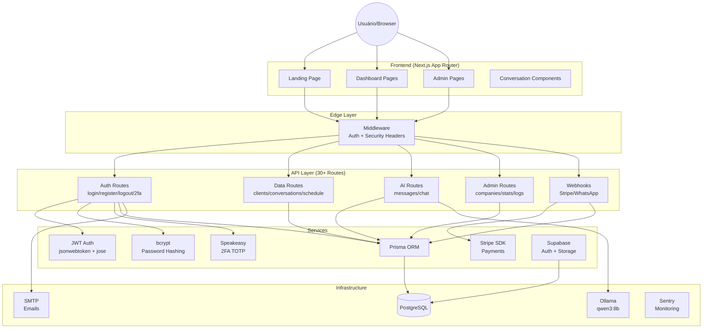
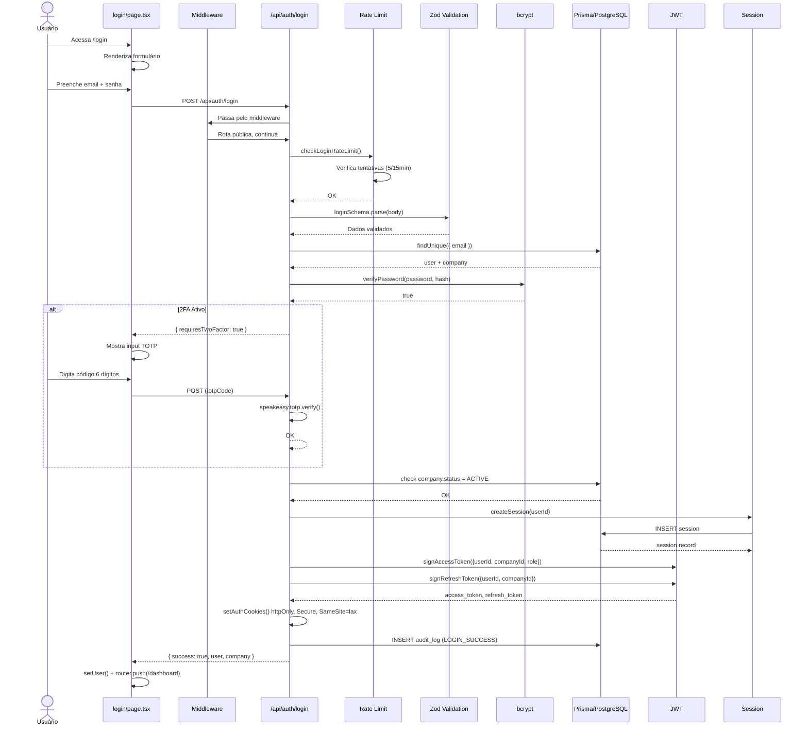
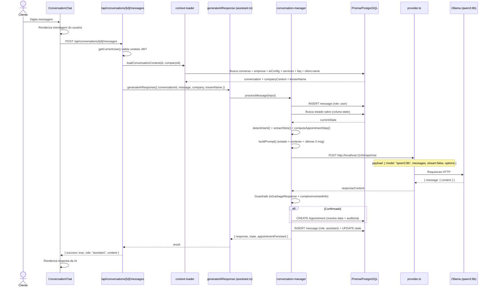
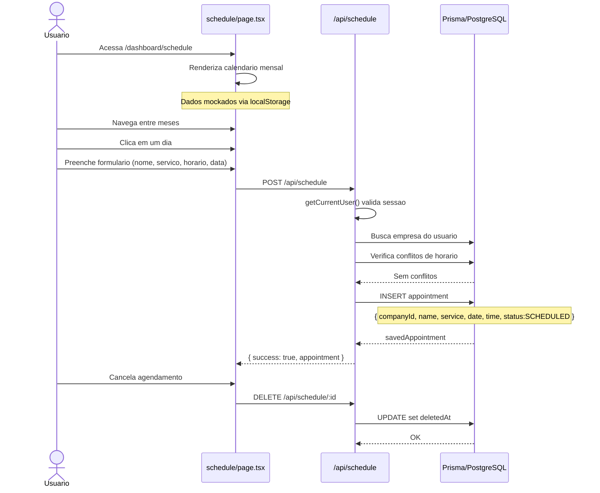
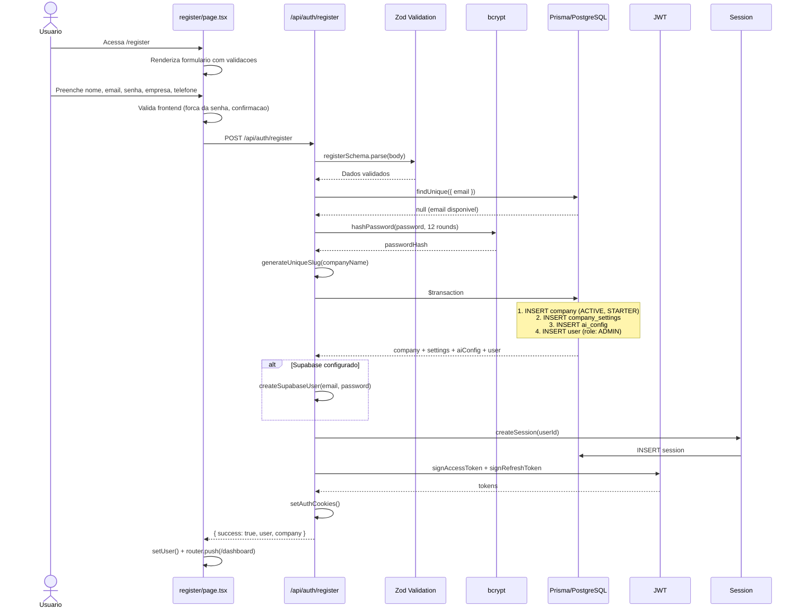

npm run dev
�ÃO TÉCNICA COMPLETA - AtendeAI

---

## 1. VISÃO GERAL

### 1.1 Objetivo do Projeto

O AtendeAI é uma **plataforma SaaS multi-tenant de atendimento automatizado com IA** para pequenas e médias empresas. O sistema permite que empresas ofereçam atendimento via WhatsApp e chat web com respostas geradas por inteligência artificial (Ollama local), com agendamento de serviços, gestão de clientes, e painel administrativo completo.

### 1.2 Problema que Resolve

Pequenas empresas (barbearias, salões, clínicas) têm dificuldade em atender todos os clientes 24/7. O AtendeAI automatiza o primeiro contato com IA, responde perguntas frequentes, agenda serviços, e encaminha para humano quando necessário.

### 1.3 Tecnologias Utilizadas

| Tecnologia | Versão | Função |
|---|---|---|
| **Next.js** | 15.3.1 | Framework React (App Router) |
| **TypeScript** | 5.8.3 | Tipagem estática |
| **React** | 19.1.0 | UI |
| **Prisma** | 6.19.3 / 7.9.0 | ORM + Migrations |
| **PostgreSQL** | 16 | Banco de dados (via Supabase) |
| **Supabase** | 2.110.8 | Auth + Storage + RLS |
| **Tailwind CSS** | 4.1.4 | Estilização |
| **Framer Motion** | 12.6.3 | Animações |
| **Radix UI** | - | Primitivos acessíveis |
| **Lucide React** | 0.483.0 | Ícones |
| **Zod** | 4.4.3 | Validação runtime |
| **bcryptjs** | 3.0.3 | Hash de senhas (12 rounds) |
| **jsonwebtoken / jose** | 9.0.3 / 6.2.4 | JWT (servidor / edge) |
| **Speakeasy** | 2.0.0 | TOTP 2FA |
| **Stripe** | 22.3.2 | Pagamentos |
| **Ollama** | 0.6.3 | LLM local (qwen3:8b) |
| **Docker** | - | Containerização |
| **Helmet** | 8.3.0 | Segurança headers |
| **Sharp** | 0.35.3 | Processamento de imagens |

### 1.4 Arquitetura Geral

```
[Usuário] → [Next.js App Router]
                ├── Landing Page (público)
                ├── Dashboard/Admin (protegido)
                └── API Routes (30+ endpoints)
                        │
                        ├── [Middleware] (Auth + Headers + Rate Limit)
                        │
                        ├── [Prisma ORM] → [PostgreSQL (Supabase)]
                        ├── [Ollama] → LLM local (IA)
                        ├── [Stripe API] → Pagamentos
                        ├── [Supabase] → Auth, Storage, RLS
                        ├── [SMTP] → Emails
                        └── [Sentry] → Monitoramento
```

### 1.5 Princípios Arquiteturais

1. **Multi-tenant**: Isolamento completo por `companyId` em todas as queries
2. **Clean Architecture**: Separação entre camadas API → Service → DB
3. **Stateless API**: Autenticação via JWT + HttpOnly cookies
4. **Segurança por Design**: OWASP Top 10 mitigado, CSP, HSTS, rate limiting
5. **Soft Delete**: Nenhum dado é removido fisicamente (exceto por admin)
6. **Auditoria**: Todas as operações críticas são registradas

---

## 2. ESTRUTURA DAS PASTAS

```
atende-ai/
├── .github/                          # GitHub Actions + Dependabot
│   └── workflows/
│       ├── ci.yml
│       ├── deploy.yml
│       └── security.yml
├── prisma/
│   ├── schema.prisma                 # Modelo completo do banco
│   └── migrations/
│       └── rls/
│           ├── 001_enable_rls.sql    # Row Level Security
│           └── 002_composite_indexes.sql
├── public/
│   └── legal/                        # Arquivos legais (vazio)
├── scripts/
│   └── backup.sh                     # Script de backup do banco
├── src/
│   ├── app/                          # Next.js App Router
│   │   ├── layout.tsx                # Root layout
│   │   ├── page.tsx                  # Landing page
│   │   ├── error.tsx                 # Global error boundary
│   │   ├── globals.css               # Tailwind v4 + CSS custom
│   │   ├── middleware.ts             # Edge middleware (auth + headers)
│   │   ├── login/                    # Página de login
│   │   │   └── page.tsx
│   │   ├── register/                 # Página de cadastro
│   │   │   └── page.tsx
│   │   ├── dashboard/                # Painel principal
│   │   │   ├── layout.tsx            # Sidebar + AuthGuard
│   │   │   ├── page.tsx              # Home do dashboard
│   │   │   ├── clients/page.tsx      # CRUD clientes
│   │   │   ├── conversations/
│   │   │   │   ├── page.tsx          # Lista conversas + chat
│   │   │   │   └── [id]/page.tsx     # Chat individual
│   │   │   ├── profile/page.tsx      # Perfil do usuário
│   │   │   ├── schedule/page.tsx     # Agenda
│   │   │   ├── settings/page.tsx     # Configurações
│   │   │   └── subscription/page.tsx # Plano/assinatura
│   │   ├── admin/                    # Painel admin
│   │   │   ├── layout.tsx
│   │   │   ├── page.tsx
│   │   │   ├── companies/
│   │   │   │   ├── page.tsx
│   │   │   │   └── [id]/page.tsx
│   │   │   └── logs/page.tsx
│   │   └── api/                      # API Routes
│   │       ├── auth/
│   │       │   ├── login/route.ts
│   │       │   ├── register/route.ts
│   │       │   ├── logout/route.ts
│   │       │   ├── me/route.ts
│   │       │   ├── refresh/route.ts
│   │       │   ├── forgot-password/route.ts
│   │       │   ├── reset-password/route.ts
│   │       │   ├── verify-email/route.ts
│   │       │   └── 2fa/
│   │       │       ├── setup/route.ts
│   │       │       ├── verify/route.ts
│   │       │       └── disable/route.ts
│   │       ├── admin/
│   │       │   ├── stats/route.ts
│   │       │   ├── companies/
│   │       │   │   ├── route.ts
│   │       │   │   └── [id]/route.ts
│   │       │   ├── audit/route.ts
│   │       │   └── logs/route.ts
│   │       ├── clients/
│   │       │   ├── route.ts
│   │       │   └── [id]/route.ts
│   │       ├── conversations/
│   │       │   ├── route.ts
│   │       │   ├── [id]/route.ts
│   │       │   └── [id]/messages/route.ts
│   │       ├── schedule/route.ts
│   │       ├── settings/route.ts
│   │       ├── subscription/route.ts
│   │       ├── upload/route.ts
│   │       ├── files/[id]/route.ts
│   │       ├── profile/route.ts
│   │       ├── health/route.ts
│   │       ├── test-supabase/route.ts
│   │       └── webhooks/
│   │           ├── stripe/route.ts
│   │           └── whatsapp/route.ts
│   ├── components/
│   │   ├── ui/                       # 14 primitives (shadcn-style)
│   │   │   ├── accordion.tsx
│   │   │   ├── avatar.tsx
│   │   │   ├── badge.tsx
│   │   │   ├── button.tsx
│   │   │   ├── card.tsx
│   │   │   ├── input.tsx
│   │   │   ├── label.tsx
│   │   │   ├── modal.tsx
│   │   │   ├── scroll-area.tsx
│   │   │   ├── select.tsx
│   │   │   ├── separator.tsx
│   │   │   ├── switch.tsx
│   │   │   ├── tabs.tsx
│   │   │   └── toast.tsx
│   │   ├── dashboard/               # 2 componentes
│   │   │   ├── AuthGuard.tsx
│   │   │   └── Sidebar.tsx
│   │   ├── landing/                  # 12 componentes
│   │   │   ├── Navbar.tsx
│   │   │   ├── Hero.tsx
│   │   │   ├── HowItWorks.tsx
│   │   │   ├── Features.tsx
│   │   │   ├── DashboardPreview.tsx
│   │   │   ├── Benefits.tsx
│   │   │   ├── Niches.tsx
│   │   │   ├── Plans.tsx
│   │   │   ├── Testimonials.tsx
│   │   │   ├── FAQ.tsx
│   │   │   ├── CTA.tsx
│   │   │   └── Footer.tsx
│   │   ├── conversations/            # 13 componentes
│   │   ├── ErrorBoundary.tsx
│   │   ├── CookieConsent.tsx
│   │   ├── CookieConsentWrapper.tsx
│   │   └── Providers.tsx
│   ├── contexts/
│   │   └── AuthContext.tsx           # Contexto de autenticação
│   ├── hooks/
│   │   ├── useDebounce.ts
│   │   └── useLocalStorage.ts
│   ├── lib/
│   │   ├── ai/                       # Sistema de IA
│   │   │   ├── assistant.ts          # Montagem do prompt
│   │   │   └── provider.ts           # Conexão com Ollama
│   │   ├── api/
│   │   │   └── client.ts             # API client wrapper
│   │   ├── auth/                     # Autenticação
│   │   │   ├── session.ts            # Sessão + cookies
│   │   │   ├── jwt.ts                # JWT (jsonwebtoken)
│   │   │   ├── jwt-edge.ts           # JWT (jose - edge runtime)
│   │   │   ├── password.ts           # Hash bcrypt
│   │   │   └── api-response.ts       # Respostas HTTP padronizadas
│   │   ├── db/
│   │   │   └── prisma.ts             # Singleton Prisma Client
│   │   ├── logger/
│   │   │   ├── index.ts              # Logger simples
│   │   │   └── structured.ts         # Logger estruturado
│   │   ├── monitoring/
│   │   │   └── sentry.ts             # Integração Sentry
│   │   ├── rate-limit/
│   │   │   └── index.ts              # Rate limiting in-memory
│   │   ├── resilience/
│   │   │   ├── retry.ts              # Retry com backoff
│   │   │   └── circuit-breaker.ts    # Circuit breaker
│   │   ├── security/
│   │   │   ├── csrf.ts               # CSRF token
│   │   │   ├── encryption.ts         # AES-256-GCM
│   │   │   ├── enumeration.ts        # Anti-enumeration
│   │   │   ├── nonce.ts              # Anti replay attack
│   │   │   └── sanitize.ts           # Sanitização
│   │   ├── storage/
│   │   │   └── access.ts             # Controle de acesso a arquivos
│   │   ├── supabase/
│   │   │   ├── client.ts             # Cliente Supabase
│   │   │   ├── auth.ts               # Auth Supabase
│   │   │   └── storage.ts            # Storage Supabase
│   │   ├── tenant/
│   │   │   ├── index.ts              # Validação multi-tenant
│   │   │   ├── guard.ts              # Guard de tenant
│   │   │   └── plan-limits.ts        # Limites por plano
│   │   ├── validators/
│   │   │   └── auth.ts               # Schemas Zod
│   │   └── utils.ts                  # cn() utility
│   ├── types/
│   │   └── css.d.ts                  # Declaração CSS modules
│   └── __tests__/                    # Testes
│       ├── setup.ts
│       ├── api-response.test.ts
│       ├── circuit-breaker.test.ts
│       ├── encryption.test.ts
│       ├── jwt.test.ts
│       ├── logger.test.ts
│       ├── password.test.ts
│       ├── rate-limit.test.ts
│       ├── retry.test.ts
│       ├── sanitize.test.ts
│       └── validators.test.ts
├── docker-compose.yml                # Orquestração Docker
├── Dockerfile                        # Build multi-stage
├── next.config.ts                    # Config Next.js
├── postcss.config.mjs                # PostCSS config
├── tsconfig.json                     # TypeScript config
├── vitest.config.ts                  # Vitest config
├── package.json
├── .env / .env.local / .env.example
└── .gitignore
```

---

## 3. ESTRUTURA DE TODOS OS ARQUIVOS

### 3.1 Arquivos Raiz

#### `package.json`
- **Caminho**: `/package.json`
- **Responsabilidade**: Gerenciamento de dependências, scripts de desenvolvimento/build/deploy/teste
- **Scripts** (30 total):
  - `dev` - `next dev` (dev server)
  - `build` - `next build`
  - `start` - `next start`
  - `lint` - `next lint`
  - `typecheck` - `tsc --noEmit`
  - `test` - `vitest run`
  - `test:watch` - `vitest`
  - `test:coverage` - `vitest run --coverage`
  - `test:ui` - `vitest --ui`
  - `db:generate` - `prisma generate`
  - `db:migrate` - `prisma migrate deploy`
  - `db:migrate:dev` - `prisma migrate dev`
  - `db:push` - `prisma db push`
  - `db:studio` - `prisma studio`
  - `db:seed` - `tsx scripts/seed.ts`
  - `db:backup` - `bash scripts/backup.sh`
  - `audit` - `npm audit --audit-level=high`
  - `format` - `prettier --write "src/**/*.{ts,tsx,css}"`
  - `format:check` - `prettier --check "src/**/*.{ts,tsx,css}"`
  - `analyze` - `ANALYZE=true next build`
  - `clean` - `rm -rf .next node_modules`
  - `docker:build` - `docker compose build`
  - `docker:up` - `docker compose up -d`
  - `docker:down` - `docker compose down`
  - `prepare` - `prisma generate` (roda pós-install)
  - `test:ci` - `vitest run --reporter=junit --outputFile=test-results.xml`
- **Dependências produção**: 28 pacotes
- **DevDependencies**: 12 pacotes
- **Quem usa**: npm, desenvolvedores, CI/CD

---

#### `tsconfig.json`
- **Caminho**: `/tsconfig.json`
- **Configurações chave**:
  - `target: ES2017`
  - `strict: true`
  - `moduleResolution: bundler`
  - `jsx: preserve`
  - `paths: { "@/*": ["./src/*"] }` → alias `@/` para `src/`
  - `plugins: [{ name: "next" }]`
- **Usado por**: TypeScript compiler, Next.js, IDE

---

#### `next.config.ts`
- **Caminho**: `/next.config.ts`
- **Responsabilidade**: Configuração completa do Next.js
- **Funcionalidades**:
  - **CSP**: Content-Security-Policy customizada com restrições severas
  - **Imagens**: formatos AVIF/WebP, deviceSizes, imageSizes, cache TTL 24h, `remotePatterns` vazio
  - **Segurança headers**: X-Frame-Options: DENY, HSTS (2 anos + preload), X-Content-Type-Options, Referrer-Policy, Permissions-Policy, COOP/COEP/CORP
  - **Cache-Control**: no-cache para páginas, 1 ano para assets estáticos
  - **Experimental**: `optimizePackageImports` (lucide-react, framer-motion, radix), `serverActions` (allowedOrigins), `staleTimes`
  - `poweredByHeader: false`, `reactStrictMode: true`, `productionBrowserSourceMaps: false`, `compress: true`, `generateEtags: true`
  - **Logging**: full URL nos fetches em development
- **Exporta**: `default nextConfig`

---

#### `postcss.config.mjs`
- **Caminho**: `/postcss.config.mjs`
- **Plugin**: `@tailwindcss/postcss` (Tailwind v4)
- **Usado por**: Next.js para processar CSS

---

#### `.env.local` / `.env` / `.env.example`
- **3 arquivos**: `.env.local` (valores reais), `.env` (template), `.env.example` (documentação)
- **Variáveis** (agrupadas):
  - **Database**: `DATABASE_URL`, `DIRECT_URL` (Supabase PostgreSQL)
  - **JWT**: `JWT_SECRET`, `JWT_EXPIRES_IN`, `JWT_REFRESH_EXPIRES_IN`
  - **Session**: `SESSION_SECRET`, `COOKIE_DOMAIN`
  - **Encryption**: `ENCRYPTION_KEY` (32 hex chars)
  - **NextAuth**: `NEXTAUTH_URL`, `NEXTAUTH_SECRET`
  - **OAuth**: `GOOGLE_CLIENT_ID`, `GOOGLE_CLIENT_SECRET`, `MICROSOFT_CLIENT_ID`, `MICROSOFT_CLIENT_SECRET`
  - **OpenAI**: `OPENAI_API_KEY`
  - **Ollama**: `AI_PROVIDER=ollama`
  - **Stripe**: `STRIPE_SECRET_KEY`, `STRIPE_WEBHOOK_SECRET`, `STRIPE_PUBLIC_KEY`, price IDs
  - **WhatsApp**: `WHATSAPP_API_KEY`, `WHATSAPP_WEBHOOK_SECRET`
  - **SMTP**: `SMTP_HOST`, `SMTP_PORT`, `SMTP_USER`, `SMTP_PASS`, `SMTP_FROM`
  - **Monitoring**: `SENTRY_DSN`, `BETTER_STACK_TOKEN`
  - **Upload**: `UPLOAD_DIR`, `MAX_UPLOAD_SIZE`
  - **Supabase**: `NEXT_PUBLIC_SUPABASE_URL`, `NEXT_PUBLIC_SUPABASE_ANON_KEY`, `SUPABASE_SERVICE_ROLE_KEY`, `SUPABASE_STORAGE_BUCKET`
  - **Cloudflare**: `CLOUDFLARE_API_TOKEN`, `CLOUDFLARE_ZONE_ID`, `CLOUDFLARE_ACCOUNT_ID`
  - **App**: `APP_URL`, `NODE_ENV`
  - **Security**: `SIGNED_URL_SECRET`
  - **Rate Limit**: `RATE_LIMIT_PER_MINUTE`, `LOGIN_RATE_LIMIT_PER_15MIN`

---

#### `.gitignore`
- **Conteúdo**: `node_modules/`, `.next/`, `.env`, `.env.local`

---

#### `docker-compose.yml`
- **Serviços**:
  1. `postgres` - PostgreSQL 16 Alpine, porta 5432, volume `postgres_data`, healthcheck
  2. `app` - Aplicação Next.js, porta 3000, depende de postgres, volume `uploads_data`
- **Uso**: Orquestração local e produção

---

#### `Dockerfile`
- **Multi-stage build**:
  1. `base` - Node 20 Alpine, libc6-compat
  2. `deps` - `npm ci --only=production`
  3. `builder` - `npm ci`, `prisma generate`, `npm run build`
  4. `runner` - Usuário `nextjs`, copia standalone, expõe porta 3000, healthcheck

---

#### `vitest.config.ts`
- **Caminho**: `/vitest.config.ts`
- **Configuração**: Test runner Vitest com coverage v8, integração TypeScript

---

### 3.2 Arquivos de Configuração Ausentes

- **`tailwind.config.*`**: Não existe - Tailwind v4 usa configuração via CSS nativo (`@tailwindcss/postcss`)
- **`.eslintrc.*` / `eslint.config.*`**: Não existe - usa ESLint embutido do Next.js + `eslint-plugin-prettier`
- **`components.json`**: Não existe - não usa shadcn/ui oficial, implementa componentes Radix manualmente

---

### 3.3 `src/middleware.ts`

- **Caminho**: `src/middleware.ts`
- **Responsabilidade**: Middleware Edge do Next.js - proteção de rotas + headers de segurança
- **Fluxo**:
  1. Ignora rotas públicas (`/api/health`, `/_next/`, `/static/`, `/favicon.ico`)
  2. Adiciona headers de segurança em TODAS as respostas (CSP, HSTS, X-Frame-Options, etc.)
  3. Protege `/dashboard/*`: verifica `access_token` via `verifyEdgeToken()` (jose)
  4. Protege `/admin/*`: verifica existência de `access_token`
  5. Protege `/api/*`: verifica `session_token` + `access_token` nos cookies
  6. Retorna 401 JSON se API não autenticada

- **Rotas públicas** (lista `PUBLIC_PATHS`):
  - `/`, `/login`, `/register`
  - `/api/test-supabase`, `/api/auth/login`, `/api/auth/register`
  - `/api/auth/forgot-password`, `/api/auth/reset-password`, `/api/auth/verify-email`
  - `/api/webhooks/stripe`, `/api/webhooks/whatsapp`, `/api/health`
  - `/legal`, `/privacy`, `/terms`

- **Matcher**: `["/((?!_next/static|_next/image|favicon.ico).*)"]`

---

### 3.4 `src/app/layout.tsx` (Root Layout)

- **Caminho**: `src/app/layout.tsx`
- **Responsabilidade**: Layout raiz de toda a aplicação
- **Conteúdo**:
  - Importa fonte Poppins (Google Fonts, weights 300-800)
  - Metadata: title "AtendeAI - Atendente Virtual com IA para WhatsApp", description, keywords
  - `<html className="dark">` (tema escuro fixo)
  - Wraps children em `<Providers>` (AuthProvider + ToastProvider) + `<CookieConsent />`

---

### 3.5 `src/app/page.tsx` (Landing Page)

- **Caminho**: `src/app/page.tsx`
- **Responsabilidade**: Página inicial pública (marketing)
- **Componentes** (ordem): `Navbar` → `Hero` → `HowItWorks` → `Features` → `DashboardPreview` → `Benefits` → `Niches` → `Plans` → `Testimonials` → `FAQ` → `CTA` → `Footer`

---

### 3.6 `src/app/error.tsx`

- **Responsabilidade**: Global error boundary (substitui layout quando erro ocorre)
- **Conteúdo**: `<html>` + `<body>` completos, ícone de alerta, botão "Tentar novamente"

---

### 3.7 `src/app/globals.css`

- **Tailwind v4**: `@import "tailwindcss"` + `@custom-variant dark (&:is(.dark *))`
- **CSS Variables**: `--background`, `--foreground`, `--primary`, `--secondary`, `--muted`, `--accent`, `--destructive`, `--border`, `--input`, `--ring`, `--sidebar`, chart colors (12 variações)
- **Dark theme**: Paleta slate-based
- **Globais**: `body { font-family: Poppins }`, `::selection`, custom scrollbar
- **Classes utilitárias**: `.glass` (backdrop blur), `.gradient-text`, `.gradient-border`
- **Animações**: `float`, `pulse-glow` com classes `.animate-float`, `.animate-pulse-glow`

---

### 3.8 `src/middleware.ts` (Edge Middleware) - Análise Completa

- **Caminho**: `src/middleware.ts`
- **Importações**:
  - `NextResponse`, `NextRequest` (next/server)
  - `verifyEdgeToken` de `@/lib/auth/jwt-edge` (jose)
- **Fluxo completo**:
  1. Se `pathname === "/api/health"` → `NextResponse.next()` (ignora tudo)
  2. Se `pathname` começa com `/_next/`, `/static/`, `/favicon.ico` → pula
  3. Cria `response = NextResponse.next()`
  4. Adiciona 9 security headers na response
  5. Verifica se é rota pública (lista `PUBLIC_PATHS` com 18 paths)
  6. Se pública → retorna response com headers
  7. Se começa com `/dashboard`:
     - Pega `access_token` do cookie
     - Se não existe → redirect `/login`
     - Se existe → `verifyEdgeToken(accessToken)` (jose)
     - Se falhou → redirect `/login`
  8. Se começa com `/admin` (não `/api/admin`):
     - Pega `access_token` do cookie
     - Se não existe → redirect `/login`
  9. Se começa com `/api/` (e não é pública):
     - Pega `session_token` + `access_token` dos cookies
     - Se algum faltar → retorna 401 JSON `{ success: false, error: "Não autorizado" }`
  10. Retorna response
- **Problema conhecido**: A verificação de token no `/dashboard` não retorna o response, apenas tenta/catch sem efeito real no fluxo

---

### 3.9 `src/contexts/AuthContext.tsx`

- **Caminho**: `src/contexts/AuthContext.tsx`
- **Responsabilidade**: Contexto global de autenticação para o frontend
- **Interface `AuthContextType`**:
  - `user: User | null` - usuário logado ou null
  - `loading: boolean` - estado de carregamento inicial
  - `login(email, password, totpCode?)` - fazer login
  - `register(name, email, password, companyName, phone?)` - cadastrar
  - `logout()` - sair
  - `refreshUser()` - recarregar dados do usuário
- **Interface `User`**:
  - `id`, `name`, `email`, `role`, `companyId`
  - `company?: { name, status, planType, subscriptionStatus }`
  - `twoFactorEnabled?: boolean`
- **Função `apiFetch`**: Wrapper fetch que:
  - Usa `credentials: "include"` (envia cookies)
  - Seta `Content-Type: application/json`
  - Loga status, URL, HTML recebido (debug)
  - Parseia JSON e verifica `success`
- **Fluxo**:
  1. `AuthProvider` monta → chama `refreshUser()` via useEffect
  2. `refreshUser` → fetch `/api/auth/me` → seta `user` ou `null`
  3. `login` → fetch POST `/api/auth/login` → seta `user` → retorna `{ success: true }`
  4. `register` → fetch POST `/api/auth/register` → seta `user` via response
  5. `logout` → fetch POST `/api/auth/logout` → seta `user = null` → router.push `/login`
- **Provider**: Envolve children no `AuthContext.Provider`
- **Hook**: `useAuth()` com verificação de contexto nulo

---

### 3.10 Componentes UI (`src/components/ui/`)

#### `button.tsx`
- **Radix**: `@radix-ui/react-slot` (asChild)
- **Variants** (class-variance-authority): `default`, `destructive`, `outline`, `secondary`, `ghost`, `link`
- **Sizes**: `default` (h-11), `sm` (h-9), `lg` (h-12), `icon` (h-10)
- **Efeitos**: shadow, hover translateY, transition-all duration-300

#### `input.tsx`
- **Estilo**: h-11, rounded-xl, border-border, focus ring-2, transition-all
- **Props**: suporta `type`, `className` (cn merged)

#### `card.tsx`
- **Subcomponentes**: `Card`, `CardHeader`, `CardTitle`, `CardDescription`, `CardContent`, `CardFooter`
- **Estilo**: rounded-xl, border-border, bg-card

#### `badge.tsx`
- **Variants**: `default`, `secondary`, `destructive`, `outline`, `success`, `warning`
- **Uso**: Status indicators (Ativo/Inativo), tags

#### `avatar.tsx`
- **Radix**: `@radix-ui/react-avatar`
- **Subcomponentes**: `Avatar`, `AvatarImage`, `AvatarFallback`
- **Uso**: Fotos de perfil, iniciais

#### `tabs.tsx`
- **Radix**: `@radix-ui/react-tabs`
- **Subcomponentes**: `Tabs`, `TabsList`, `TabsTrigger`, `TabsContent`
- **Estilo**: rounded-xl, secondary bg para lista

#### `modal.tsx`
- **Animações**: Framer Motion (fade + scale)
- **Funcionalidade**: Overlay com backdrop blur, scroll interno, botão X
- **Props**: `open`, `onClose`, `title`, `children`

#### `toast.tsx`
- **Context-based**: `ToastContext` + `useToast()` hook
- **Tipos**: `success` (emerald), `error` (red), `info` (blue)
- **Comportamento**: Auto-dismiss em 3.5s, animação slide-up, máximo 1 linha
- **Provider**: `ToastProvider` envolve children, renderiza toasts em fixed bottom-right

#### `select.tsx`
- **Radix**: `@radix-ui/react-select`
- **Subcomponentes**: `Select`, `SelectTrigger`, `SelectContent`, `SelectItem`, `SelectGroup`, `SelectValue`
- **Features**: ScrollUp/ScrollDown buttons, portal, item indicator com Check

#### `accordion.tsx`
- **Radix**: `@radix-ui/react-accordion`
- **Subcomponentes**: `Accordion`, `AccordionItem`, `AccordionTrigger`, `AccordionContent`
- **Animações**: rotate chevron, accordion-up/down

#### `switch.tsx`, `separator.tsx`, `scroll-area.tsx`, `label.tsx`
- Todos wrappers de Radix UI com estilo padronizado

---

### 3.11 Componentes Dashboard

#### `AuthGuard.tsx`
- **Função**: Protege rotas do dashboard
- **Fluxo**:
  1. Pega `user` e `loading` do `useAuth()`
  2. Se `loading` → mostra spinner
  3. Se `!loading && !user` → redirect `/login` via useEffect
  4. Se `!user` → mostra spinner (enquanto redirect não acontece)
  5. Se `user` → renderiza children

#### `Sidebar.tsx`
- **Itens do menu**: Dashboard, Conversas, Agenda, Clientes, Configurações, Assinatura, Perfil
- **Comportamento**:
  - Estado `collapsed` (sidebar retrátil) e `mobileOpen` (mobile drawer)
  - Destaque do link ativo via `pathname`
  - Mostra botão "Admin" (ícone Shield) se `user.role === "ADMIN"`
  - Mostra info do usuário (avatar inicial, nome, email)
  - Botão "Sair" com confirmação
  - Animação Framer Motion no mobile drawer
- **Responsivo**: `lg:sticky`, mobile: fixed + drawer overlay

---

### 3.12 Componentes Landing (12 componentes) — Análise Detalhada

#### `Navbar.tsx`
- **Caminho**: `src/components/landing/Navbar.tsx`
- **Responsabilidade**: Navbar fixa no topo com efeito glass ao scrollar, links de navegação desktop, estado autenticado (avatar + nome + botão sair) ou botões de login/registro, e menu mobile tipo drawer com animação.
- **Props/State**: Nenhuma prop. Estados internos: `scrolled` (`boolean`, useState), `mobileOpen` (`boolean`, useState). Do hook `useAuth()`: `user` (`User | null`) e `logout` (`() => void`).
- **Funções**: `onScroll` (effect listener) — atualiza `scrolled` conforme `window.scrollY > 20`.
- **Fluxo interno**: `motion.nav` fade-in → container → logo `Link` → div.links-desktop → `navLinks.map` → div.auth-desktop (`user ?` exibe dashboard + avatar + logout `: Entrar` + `Começar Agora`) → hamburger button → `AnimatePresence` → se `mobileOpen`, drawer com links + auth.
- **Quem chama**: Landing page (`src/app/page.tsx`).
- **Dependências**: `react` (useState, useEffect), `framer-motion` (motion, AnimatePresence), `lucide-react` (Menu, X, MessageSquareMore, LogOut, LayoutDashboard), `@/components/ui/button`, `@/contexts/AuthContext`, `next/link`.
- **Eventos**: `scroll` no `window` (effect), clique no hambúrguer, clique em logout, clique em links do menu mobile (fecha drawer).
- **Problemas**: `User` importado mas não usado; scroll listener sem throttle/debounce; sem `key` explícita nos filhos do `AnimatePresence`.
- **Observações**: Navegação condicional por auth state. Usa classe CSS `glass` para efeito de vidro.

#### `Hero.tsx`
- **Caminho**: `src/components/landing/Hero.tsx`
- **Responsabilidade**: Seção hero full-screen com título animado, CTA duplo (registro + agendar demo), prova social, ícones flutuantes decorativos, preview mockado do dashboard e modal de agendamento de demonstração com formulário.
- **Props/State**: Nenhuma prop. Estados: `demoOpen` (`boolean`), `demoForm` (`{name, email, phone, company}`), `sending` (`boolean`), `sent` (`boolean`). Hook: `toast` de `useToast()`.
- **Funções**: `handleDemoSubmit` (async) — valida campos obrigatórios, simula delay 2s, salva em `localStorage("atendeai_demos")`, mostra estado de sucesso, reseta após 1.5s.
- **Fluxo interno**: Background com 3 blur gradients → grid 2 colunas → left: pill "IA disponível 24h" → h1 → p → CTAs → "2.000 empresas" → right (hidden mobile): 4 ícones flutuantes com `animate-float` → mockup janela navegador com sidebar, stats, gráfico de barras → card flutuante "Nova mensagem" → Modal com form (nome, email, telefone, empresa) ou tela de sucesso.
- **Quem chama**: Landing page (`src/app/page.tsx`).
- **Dependências**: `react` (useState), `framer-motion` (motion), `@/components/ui/button`, `@/components/ui/input`, `@/components/ui/label`, `lucide-react` (ArrowRight, Play, MessageSquareMore, Bot, CalendarCheck, Bell, Loader2, Check), `@/components/ui/toast`, `@/components/ui/modal`, `next/link`.
- **Eventos**: Clique "Começar Agora" (navega /register), clique "Agendar Demonstração" (abre modal), submit do form (valida + salva), input changes, clique fora do modal (fecha se não estiver enviando).
- **Problemas**: `localStorage` quebra SSR se não houver `window`; sem fallback se localStorage estiver cheio/desabilitado; delay simulado de 2s sem chamada real de API; sem validação de email/telefone além de `trim()`.
- **Observações**: Modal trava fechamento durante envio (`if (!sending) setDemoOpen(false)`).

#### `HowItWorks.tsx`
- **Caminho**: `src/components/landing/HowItWorks.tsx`
- **Responsabilidade**: Seção explicativa de 4 passos do fluxo de atendimento: cliente envia mensagem → IA responde → agenda → notificação.
- **Props/State**: Nenhuma.
- **Fluxo interno**: `<section id="como-funciona">` → container → título + subtítulo animados → `div.relative` com linha conectora gradient (hidden mobile) → grid 4 colunas → cada step: wrapper com `motion.div` → ícone em caixa gradient com badge numérico → título → descrição.
- **Quem chama**: Landing page.
- **Dependências**: `framer-motion` (motion), `lucide-react` (MessageSquare, Bot, CalendarCheck, Bell).
- **Eventos**: Scroll (via `whileInView`).
- **Problemas**: Linha conectora com posições hardcoded `left-[15%] right-[15%]` — não escala se conteúdo mudar; badge numérico sem semântica `<ol>` — inacessível para leitores de tela.
- **Observações**: `whileInView` com `viewport: { once: true }` garante animação única.

#### `Features.tsx`
- **Caminho**: `src/components/landing/Features.tsx`
- **Responsabilidade**: Grid de 10 cards de funcionalidades com ícones, título e descrição.
- **Props/State**: Nenhuma.
- **Fluxo interno**: `<section id="recursos">` → container → título + subtítulo animados → grid responsivo (1→2→3→4 colunas) → cada feature: `motion.div` com `whileHover`, `whileInView` → container ícone gradient → título → descrição.
- **Quem chama**: Landing page.
- **Dependências**: `framer-motion` (motion), `lucide-react` (MessageSquareMore, Bot, CalendarCheck, Bell, BarChart3, History, Users, TrendingUp, Smartphone, Settings2).
- **Eventos**: Hover (elevação via `whileHover`).
- **Problemas**: 10 features sem priorização visual — igual peso para todas; nenhuma interatividade além de hover.
- **Observações**: Grid adaptativo com `xl:grid-cols-4`. Efeito hover sobe 4px com escala no ícone.

#### `DashboardPreview.tsx`
- **Caminho**: `src/components/landing/DashboardPreview.tsx`
- **Responsabilidade**: Mockup realístico do dashboard com sidebar, 4 cards de estatísticas, lista de conversas recentes e agenda do dia.
- **Props/State**: Nenhuma.
- **Fluxo interno**: Section → bg gradient → container → título + subtítulo → janela com "traffic lights" + URL bar → flex row: sidebar (logo + 5 nav items) → main: header "Visão Geral" + timestamp → grid 4 stat cards → grid 2 colunas: "Conversas Recentes" (3 itens) + "Agenda de Hoje" (4 horários).
- **Quem chama**: Landing page.
- **Dependências**: `framer-motion` (motion), `lucide-react` (LayoutDashboard, MessageSquare, Calendar, Users, Settings, TrendingUp, Clock, CheckCircle2, ArrowUpRight).
- **Problemas**: Nav items da sidebar são `<div>` e não `<Link>` — parecem clicáveis mas não são; timestamp "Atualizado agora" é estático; todos os dados são hardcoded.
- **Observações**: Mockup detalhado com janela de navegador simulada.

#### `Benefits.tsx`
- **Caminho**: `src/components/landing/Benefits.tsx`
- **Responsabilidade**: Seção de 6 benefícios com ícones em gradiente colorido, destacando proposta de valor.
- **Props/State**: Nenhuma.
- **Fluxo interno**: Section → container → título + subtítulo animados → grid 3 colunas → cada benefit: `motion.div` com `whileHover`/`whileInView` → wrapper ícone com gradient colorido → título → descrição.
- **Quem chama**: Landing page.
- **Dependências**: `framer-motion` (motion), `lucide-react` (Clock, Users, Bell, CalendarX, TrendingUp, Moon).
- **Problemas**: `bg-[#111827]` hardcoded no inner container do ícone — inconsistente com `Niches.tsx` que usa `bg-[#0F172A]`.
- **Observações**: Cada benefício tem cor gradient única.

#### `Niches.tsx`
- **Caminho**: `src/components/landing/Niches.tsx`
- **Responsabilidade**: Grid de 10 nichos de mercado atendidos pelo produto, com ícones temáticos e gradientes.
- **Props/State**: Nenhuma.
- **Fluxo interno**: Section → bg gradient sutil → container → título + subtítulo animados → grid responsivo (2→3→5 colunas) → cada nicho: `motion.div` com `whileInView` (scale) + `whileHover` (elevação) → container ícone gradient → título.
- **Quem chama**: Landing page.
- **Dependências**: `framer-motion` (motion), `lucide-react` (Scissors, Stethoscope, Sparkles, Smile, Brain, Dumbbell, Wrench, UtensilsCrossed, UserRound, Store).
- **Problemas**: `bg-[#0F172A]` inconsistente com outros componentes (`#111827` em Benefits); `cursor-default` em cards que têm hover animation.
- **Observações**: Usa `initial={{ scale: 0.9 }}` — animação de escala diferente dos demais.

#### `Plans.tsx`
- **Caminho**: `src/components/landing/Plans.tsx`
- **Responsabilidade**: Tabela de preços com 3 planos (Starter R$59, Pro R$119, Business R$249), destaque "Mais Popular" no Pro.
- **Props/State**: Nenhuma.
- **Fluxo interno**: `<section id="planos">` → container → título + subtítulo → grid 3 colunas → cada plano: badge condicional (Star + "Mais Popular") → nome → descrição → preço → lista de features com ícone Check → CTA button.
- **Quem chama**: Landing page.
- **Dependências**: `framer-motion` (motion), `lucide-react` (Check, ArrowRight, Star), `@/components/ui/button`, `next/link`.
- **Problemas**: `scale-105 lg:scale-110` no Pro pode causar overflow; CTA linka para `#comecar` (id no CTA.tsx) mas expectativa pode ser `/register`; preços hardcoded em string.
- **Observações**: Plano destacado recebe border azul, gradient background, sombra e scale maior.

#### `Testimonials.tsx`
- **Caminho**: `src/components/landing/Testimonials.tsx`
- **Responsabilidade**: Seção de depoimentos com 4 cards contendo avaliação por estrelas, citação e autor com avatar inicial.
- **Props/State**: Nenhuma.
- **Fluxo interno**: Section → bg gradient → container → título + subtítulo → grid 4 colunas → cada card: `motion.div` → 5 estrelas (`fill-amber-400`) → citação → autor: avatar circular gradient com iniciais + nome + cargo.
- **Quem chama**: Landing page.
- **Dependências**: `framer-motion` (motion), `lucide-react` (Star).
- **Problemas**: Apenas 4 depoimentos; todas as avaliações são 5 estrelas (pouco realista); sem fotos reais; dados hardcoded.
- **Observações**: Grid usa `lg:grid-cols-4`.

#### `FAQ.tsx`
- **Caminho**: `src/components/landing/FAQ.tsx`
- **Responsabilidade**: Seção de perguntas frequentes em formato accordion, 6 itens.
- **Props/State**: Nenhuma.
- **Fluxo interno**: `<section id="faq">` → container → título + subtítulo animados → `Accordion` (type="single", collapsible) → 6 `AccordionItem`.
- **Quem chama**: Landing page.
- **Dependências**: `framer-motion` (motion), `@/components/ui/accordion`.
- **Eventos**: Clique no trigger do accordion para expandir/recolher.
- **Problemas**: `value` usa índice do array — frágil para listas dinâmicas.
- **Observações**: Usa componente Accordion customizado. Dados hardcoded.

#### `CTA.tsx`
- **Caminho**: `src/components/landing/CTA.tsx`
- **Responsabilidade**: Seção final de call-to-action com botão principal "Começar Agora" e fundo com blur gradient.
- **Props/State**: Nenhuma.
- **Fluxo interno**: `<section id="comecar">` → bg blur gradient → container → card com borda gradient → ícone Sparkles animado → h2 → p → botão "Começar Agora".
- **Quem chama**: Landing page.
- **Dependências**: `framer-motion` (motion), `lucide-react` (ArrowRight, Sparkles), `@/components/ui/button`, `next/link`.
- **Problemas**: "Começar Agora" linka para `/dashboard` em vez de `/register` — possível erro.
- **Observações**: `id="comecar"` é alvo dos links `#comecar` no Plans.tsx.

#### `Footer.tsx`
- **Caminho**: `src/components/landing/Footer.tsx`
- **Responsabilidade**: Rodapé completo com logo, descrição, 4 links de redes sociais, 3 colunas de links (Produto, Empresa, Legal) e copyright dinâmico.
- **Props/State**: Nenhuma.
- **Fluxo interno**: Footer → container → grid (2→4 colunas): col 1: logo + descrição + social icons → col 2-4: `Object.values(footerLinks).map` → título + lista de links → bottom bar: copyright.
- **Quem chama**: Landing page.
- **Dependências**: `lucide-react` (MessageSquareMore, Twitter, Instagram, Linkedin, Youtube), `next/link`.
- **Problemas**: Todos os links sociais apontam para `#` — placeholders.
- **Observações**: Copyright usa `{new Date().getFullYear()}` — data dinâmica.

---

### 3.13 Componentes Conversas (13 arquivos) — Análise Detalhada

#### `types.ts`
- **Caminho**: `src/components/conversations/types.ts`
- **Responsabilidade**: Define as interfaces TypeScript utilizadas por todos os componentes de conversação.
- **Interfaces exportadas**: `Client` (id, name, phone, email?, lastService?, notes?, status?, date?, timestamps), `Conversation` (id, phone, name?, status, unread, lastMessage?, lastMessageAt?, createdAt, updatedAt, clientId?, messages?, client?), `Message` (id, role: "user" | "assistant", content, type?, createdAt, conversationId?).
- **Quem chama**: Todos os componentes da pasta `conversations/`.
- **Observações**: `Message.role` usa string literal union. `Conversation` inclui `messages?` e `client?` como opcionais.

#### `ConversationLayout.tsx`
- **Caminho**: `src/components/conversations/ConversationLayout.tsx`
- **Responsabilidade**: Componente raiz do módulo de conversações. Orquestra os três painéis: sidebar, chat e detalhes.
- **Props/State**: `selectedConversation: string | null`, `selectedConversationData: Conversation | null`, `messages: Message[]`.
- **Fluxo interno**: Renderiza container flex com `ConversationSidebar` (passa `selectedConversation` e `onSelectConversation`), `ConversationChat` (passa `conversation`, `messages`, `setMessages`) e condicionalmente `ConversationDetails`. Ao selecionar uma conversa, faz fetch de `/api/conversations/{id}` e preenche os states.
- **Quem chama**: Página de conversas (`app/dashboard/conversations/page.tsx`).
- **Dependências**: `react` (useState), `ConversationSidebar`, `ConversationChat`, `ConversationDetails`, `./types`.
- **Eventos**: Clique em item da lista → dispara `onSelectConversation` → fetch da conversa.
- **Problemas**: Fetch inline sem tratamento de erro; sem loading state; sem cache/abort.
- **Observações**: Usa `h-[calc(100vh-4rem)]` responsivo com breakpoint `lg`.

#### `ConversationSidebar.tsx`
- **Caminho**: `src/components/conversations/ConversationSidebar.tsx`
- **Responsabilidade**: Painel lateral esquerdo que agrupa busca, filtros e lista de conversas.
- **Props**: `selectedConversation`, `onSelectConversation`.
- **State local**: `search: string` (default `""`), `filterStatus: string` (default `"all"`).
- **Fluxo interno**: Renderiza `ConversationSearch`, `ConversationFilters` e `ConversationList`. Layout flex column com largura fixa `w-full lg:w-[380px]`.
- **Quem chama**: `ConversationLayout`.
- **Dependências**: `react` (useState), `ConversationSearch`, `ConversationFilters`, `ConversationList`.

#### `ConversationSearch.tsx`
- **Caminho**: `src/components/conversations/ConversationSearch.tsx`
- **Responsabilidade**: Input de busca textual com ícone de lupa.
- **Props**: `search`, `onSearchChange`.
- **Fluxo interno**: Input com ícone Search posicionado absolutamente à esquerda.
- **Quem chama**: `ConversationSidebar`.
- **Dependências**: `lucide-react` (Search), `@/components/ui/input`.
- **Observações**: Componente controlado, sem debounce.

#### `ConversationFilters.tsx`
- **Caminho**: `src/components/conversations/ConversationFilters.tsx`
- **Responsabilidade**: Barra de filtros por status (Todas, Pendentes, Ativas, Concluídas).
- **Props**: `filterStatus`, `onFilterChange`.
- **Fluxo interno**: Mapeia `FILTERS` array (4 opções), renderiza `Button` para cada. Botão ativo recebe `variant="default"`.
- **Quem chama**: `ConversationSidebar`.
- **Dependências**: `@/components/ui/button`.

#### `ConversationList.tsx`
- **Caminho**: `src/components/conversations/ConversationList.tsx`
- **Responsabilidade**: Busca a lista de conversas da API, aplica filtros e renderiza `ConversationItem`.
- **Props**: `selectedConversation`, `onSelectConversation`, `search`, `filterStatus`.
- **State local**: `conversations: Conversation[]`, `loading: boolean`.
- **Funções**: `useEffect` — fetch de `/api/conversations` na montagem. `useMemo` (`filtered`) — filtra por search (name/phone) e filterStatus.
- **Fluxo interno**: Se `loading`, renderiza "Carregando...". Se `filtered` vazio, "Nenhuma conversa encontrada". Caso contrário, mapeia para `ConversationItem`.
- **Quem chama**: `ConversationSidebar`.
- **Dependências**: `react` (useState, useEffect, useMemo), `ConversationItem`, `./types`.
- **Problemas**: Fetch apenas na montagem — sem refetch ou polling; erro no fetch silencioso; sem tipagem da resposta.

#### `ConversationItem.tsx`
- **Caminho**: `src/components/conversations/ConversationItem.tsx`
- **Responsabilidade**: Renderiza um item individual na lista de conversas.
- **Props**: `conversation`, `selected`, `onClick`.
- **Fluxo interno**: Exibe nome (ou telefone como fallback), data formatada, última mensagem truncada, bullet colorido por status, e ponto azul se `unread`.
- **Quem chama**: `ConversationList`.
- **Dependências**: `./types`.
- **Eventos**: Clique no item → `onClick()`.

#### `ConversationChat.tsx`
- **Caminho**: `src/components/conversations/ConversationChat.tsx`
- **Responsabilidade**: Painel central de conversa. Gerencia header, mensagens, scroll automático e input.
- **Props**: `conversation`, `messages`, `setMessages`.
- **State local**: `messagesEndRef` (useRef).
- **Fluxo interno**: Se `conversation` null, renderiza tela vazia. Caso contrário, renderiza `ConversationHeader`, `ConversationMessages`, div com ref para scroll, e `ConversationInput`. `useEffect` faz scroll suave sempre que `messages` muda.
- **Quem chama**: `ConversationLayout`.
- **Dependências**: `react` (useRef, useEffect), `ConversationHeader`, `ConversationMessages`, `ConversationInput`.
- **Problemas**: Scroll forçado pode ser indesejado se usuário estiver lendo mensagens antigas.

#### `ConversationMessages.tsx`
- **Caminho**: `src/components/conversations/ConversationMessages.tsx`
- **Responsabilidade**: Renderiza lista de mensagens com alinhamento por role.
- **Props**: `messages: Message[]`.
- **Fluxo interno**: Se vazio, "Nenhuma mensagem ainda". Mapeia mensagens: assistant → `justify-start` com `bg-secondary/50`, user → `justify-end` com `bg-blue-500`. Exibe conteúdo e horário.
- **Quem chama**: `ConversationChat`.
- **Dependências**: `./types`.

#### `ConversationInput.tsx`
- **Caminho**: `src/components/conversations/ConversationInput.tsx`
- **Responsabilidade**: Input de texto para envio de mensagens com estado de loading.
- **Props**: `conversationId`, `setMessages`.
- **State local**: `input: string`, `sending: boolean`.
- **Funções**: `handleSend` — POST para `/api/conversations/{id}/messages`, depois GET para recarregar mensagens, chama `setMessages`.
- **Fluxo interno**: Input + botão. Botão mostra `Loader2` se `sending`. Enter (sem Shift) dispara `handleSend`.
- **Quem chama**: `ConversationChat`.
- **Dependências**: `react` (useState), `lucide-react` (Send, Loader2), `@/components/ui/button`, `@/components/ui/input`.
- **Problemas**: Duas chamadas à API (POST + GET); sem feedback visual de erro; sem debounce/rate-limit.

#### `ConversationHeader.tsx`
- **Caminho**: `src/components/conversations/ConversationHeader.tsx`
- **Responsabilidade**: Cabeçalho do chat com avatar circular, nome e telefone.
- **Props**: `conversation`.
- **Funções**: `getName(c)` — retorna `client.name` → `name` → `phone` como fallback.
- **Fluxo interno**: Avatar com primeira letra, nome e telefone.
- **Quem chama**: `ConversationChat`.
- **Dependências**: `./types`.

#### `ConversationDetails.tsx`
- **Caminho**: `src/components/conversations/ConversationDetails.tsx`
- **Responsabilidade**: Painel lateral direito com detalhes do cliente e controle de status. Visível apenas em `lg+`.
- **Props**: `conversation`.
- **Fluxo interno**: Se `client` existir, renderiza avatar (64px), nome, badge status, Separator, informações (telefone, email, serviço, notas), outro Separator, e `StatusSelect`. Largura fixa `w-80`.
- **Quem chama**: `ConversationLayout` (condicional).
- **Dependências**: `lucide-react` (Phone, Mail, Calendar, FileText), `@/components/ui/badge`, `@/components/ui/separator`, `StatusSelect`.
- **Problemas**: Ícone `X` importado mas não usado.

#### `StatusSelect.tsx`
- **Caminho**: `src/components/conversations/StatusSelect.tsx`
- **Responsabilidade**: Select para alterar status da conversa com feedback via toast.
- **Props**: `conversationId`, `currentStatus`.
- **State local**: `status: string`, `updating: boolean`.
- **Funções**: `handleChange(value)` — PATCH para `/api/conversations/{id}` com novo status, atualiza estado local, mostra toast.
- **Quem chama**: `ConversationDetails`.
- **Dependências**: `react` (useState), `@/components/ui/select`, `@/components/ui/toast`.

---

### 3.14 Páginas do Dashboard - `src/app/dashboard/`

#### `layout.tsx`
- **Caminho**: `src/app/dashboard/layout.tsx`
- **Responsabilidade**: Layout do dashboard com sidebar + proteção de autenticação
- **Fluxo**:
  1. Envolve `<AuthGuard>` (se não logado → redirect /login)
  2. Renderiza `<Sidebar />` fixa à esquerda
  3. Renderiza `<main>` com padding responsivo

#### `page.tsx` (Dashboard Home)
- **Responsabilidade**: Página inicial do dashboard com resumo do negócio
- **Seções**: Stats cards (4), Conversas Recentes (4), Agenda de Hoje (4), Gráfico de barras (7 dias)
- **Animações**: Framer Motion com delays

#### `clients/page.tsx`
- **Responsabilidade**: CRUD de clientes com busca
- **Persistência**: localStorage via `useLocalStorage`
- **Problema**: Dados mockados não integram com API real

#### `conversations/page.tsx`
- **Responsabilidade**: Chat em tempo real - listagem e conversa
- **Layout**: Split horizontal - sidebar (350px) + chat area
- **Fluxo**: Carrega conversas → seleciona → carrega mensagens → envia → atualiza

#### `conversations/[id]/page.tsx`
- **Responsabilidade**: Página de conversa individual (rota dinâmica)
- **Problema**: Duplicata funcional com conversations/page.tsx

#### `profile/page.tsx`
- **Responsabilidade**: Gerenciamento de perfil do usuário
- **Persistência**: localStorage
- **Problema**: Não integra com API real `/api/profile`

#### `schedule/page.tsx`
- **Responsabilidade**: Agenda com calendário mensal
- **Features**: Navegação entre meses, seleção de dia, CRUD de agendamentos
- **Persistência**: localStorage via `useLocalStorage`
- **Dados mockados**: 5 agendamentos padrão

#### `settings/page.tsx`
- **Responsabilidade**: Configurações da empresa para IA
- **Seções**: Informações, Serviços/Preços, Mensagens, FAQ, Configs adicionais
- **Integração API**: GET `/api/settings` e PUT `/api/settings`
- **Features**: Adicionar/remover serviços e FAQ dinamicamente, toggles

#### `subscription/page.tsx`
- **Responsabilidade**: Gerenciamento de plano/assinatura
- **Planos**: Starter (R$59), Pro (R$119), Business (R$249)
- **Integração API**: GET `/api/subscription` e POST `/api/subscription`
- **Features**: Troca de plano com modal de confirmação

---

### 3.15 Páginas de Autenticação

#### `login/page.tsx`
- **Responsabilidade**: Página de login
- **Problemas**: Usa `window.location.href` (hard reload), usa `alert()` (UX pobre)

#### `register/page.tsx`
- **Responsabilidade**: Página de cadastro com validação completa
- **Validações**: Nome, email, senha (8+ chars, maiúscula+minúscula+número), confirmação, empresa
- **UX**: Password strength bar, Eye/EyeOff toggle, Check/X icons

---

### 3.16 Páginas Admin

#### `admin/layout.tsx`
- **Caminho**: `src/app/admin/layout.tsx`
- **Responsabilidade**: Layout do admin panel com proteção de role ADMIN
- **Fluxo**: Usa `useAuth()` para obter `user`. Se `user.role !== "ADMIN"`, redireciona para `/dashboard`. Renderiza `<main>` com conteúdo.
- **Quem chama**: Next.js App Router para rotas `/admin/*`.
- **Dependências**: `@/contexts/AuthContext`, `next/navigation`.
- **Problemas**: Sem sidebar/menu de navegação admin — apenas conteúdo puro.

#### `admin/page.tsx`
- **Caminho**: `src/app/admin/page.tsx`
- **Responsabilidade**: Dashboard administrativo com estatísticas do sistema.
- **Fluxo**: Fetch GET `/api/admin/stats` → exibe cards de Empresas, Usuários, Clientes, MRR, distribuição de planos (gráfico de pizza), receita mensal (gráfico de barras).
- **Dependências**: `react` (useState, useEffect), `framer-motion`, `@/components/ui/card`, `lucide-react`.
- **Problemas**: Dados mockados como fallback se API falhar.

#### `admin/companies/page.tsx`
- **Caminho**: `src/app/admin/companies/page.tsx`
- **Responsabilidade**: Lista de todas as empresas com busca, filtro por status, paginação.
- **Fluxo**: Fetch GET `/api/admin/companies` → tabela com nome, slug, plano, status, assinatura, ações. Modal para suspender/ativar/alterar plano.
- **Dependências**: `react`, `@/components/ui/*`, `framer-motion`, `lucide-react`, `useDebounce`.
- **Observações**: NOTA: `src/app/admin/companies/[id]/page.tsx` não existe — documentação anterior listava mas arquivo não foi encontrado no sistema de arquivos.

#### `admin/logs/page.tsx`
- **Caminho**: `src/app/admin/logs/page.tsx`
- **Responsabilidade**: Auditoria e logs do sistema com filtros por ação, data, empresa, usuário.
- **Fluxo**: Fetch GET `/api/admin/logs` com query params → tabela de logs com timestamp, ação, entidade, descrição, IP. Paginação.
- **Dependências**: `react`, `@/components/ui/*`, `lucide-react`.

#### `admin/audit/page.tsx`
- **Caminho**: `src/app/admin/audit/page.tsx`
- **Responsabilidade**: Página de auditoria detalhada do admin.
- **Fluxo**: Fetch GET `/api/admin/audit` → tabela detalhada com informações de auditoria (ação, entidade, dados anteriores/novos, usuário, IP, timestamp).
- **Dependências**: `react`, `@/components/ui/*`, `lucide-react`.

---

### 3.17 Componentes Providers e Auxiliares

#### `ErrorBoundary.tsx`
- **Caminho**: `src/components/ErrorBoundary.tsx`
- **Responsabilidade**: Componente de boundary de erro (error boundary pattern) para capturar erros em componentes filhos.
- **Fluxo**: Usa `componentDidCatch` (class component). Renderiza erro com fallback UI e loga via `logger.error`.
- **Quem chama**: Importado em layout ou páginas específicas.
- **Dependências**: `react` (Component), `@/lib/logger/structured`.
- **Observações**: Componente de classe (não functional).

#### `CookieConsent.tsx`
- **Caminho**: `src/components/CookieConsent.tsx`
- **Responsabilidade**: Banner de consentimento de cookies (LGPD). Aparece na parte inferior até o usuário aceitar.
- **Fluxo**: Salva consentimento em `localStorage`. Se já consentiu, não renderiza. Botão "Aceitar" fecha o banner.
- **Dependências**: `react` (useState, useEffect), `framer-motion`.
- **Problemas**: Persistência via localStorage (pode ser limpo pelo usuário).

#### `CookieConsentWrapper.tsx`
- **Caminho**: `src/components/CookieConsentWrapper.tsx`
- **Responsabilidade**: Wrapper server-side para `CookieConsent`. Envolve o componente client-side em dynamic import com `ssr: false`.
- **Fluxo**: Dynamic import de `CookieConsent` com `{ ssr: false }`.
- **Observações**: Usado no root layout para evitar SSR do banner.

#### `Providers.tsx`
- **Caminho**: `src/components/Providers.tsx`
- **Responsabilidade**: Agrega todos os providers da aplicação: `AuthProvider` (contexto de autenticação) + `ToastProvider` (toasts).
- **Fluxo**: Envolve `children` em `AuthProvider` → `ToastProvider`.
- **Quem chama**: `src/app/layout.tsx` (root layout).

---

### 3.18 Páginas de Autenticação e Legais

#### `login/page.tsx`
- **Caminho**: `src/app/login/page.tsx`
- **Responsabilidade**: Página de login com formulário email + senha.
- **State**: `email: string`, `password: string`, `loading: boolean`.
- **Fluxo**: Submit → chama `login(email, password)` do AuthContext. Se sucesso, faz `window.location.href = "/dashboard"` (hard reload). Se erro, exibe `alert(result.error)`.
- **Dependências**: `react` (useState), `next/navigation` (useRouter), `@/contexts/AuthContext`.
- **Problemas**: `window.location.href` causa perda de estado (hard reload em vez de `router.push`). `alert()` para erros (UX pobre). Sem tratamento de 2FA. CSS inline básico sem componentes shadcn/ui. Link para "Esqueci senha" ausente.
- **Observações**: Página com design minimalista — não usa o padrão glass/layout do resto do sistema.

#### `register/page.tsx`
- **Caminho**: `src/app/register/page.tsx`
- **Responsabilidade**: Página de cadastro com validação completa no frontend.
- **State**: `form` (name, email, password, confirmPassword, companyName, phone), `showPassword`, `loading`, `errors`.
- **Funções**: `validate()` — verifica nome, email (regex), senha (8+ chars, maiúscula+minúscula+número), confirmação, empresa. `handleSubmit` — chama `register()` do AuthContext.
- **Fluxo**: Renderiza formulário com: nome, email, empresa, telefone (opcional), senha (com strength bar e eye toggle), confirmação (com Check/X icon). Submit → valida → chama API → toast sucesso → router.push /dashboard.
- **Dependências**: `react` (useState), `framer-motion`, `@/components/ui/*`, `@/contexts/AuthContext`, `next/navigation`, `next/link`.
- **Problemas**: Sem validação de telefone; strength bar conta 5 níveis mas critérios têm peso igual.
- **Observações**: Design consistente com o resto do sistema (glass, gradient, framer-motion). Inclui links para termos e privacidade.

#### `forgot-password/page.tsx`
- **Caminho**: `src/app/forgot-password/page.tsx`
- **Responsabilidade**: Página de recuperação de senha. Após submit, mostra estado de sucesso.
- **State**: `email`, `loading`, `sent`.
- **Fluxo**: Submit → POST `/api/auth/forgot-password` → se sucesso, exibe tela de confirmação com ícone CheckCircle.
- **Dependências**: `react` (useState), `framer-motion`, `@/components/ui/*`, `lucide-react`, `next/link`.
- **Problemas**: Sem validação de email no frontend além de `trim()`.

#### `privacy/page.tsx`
- **Caminho**: `src/app/privacy/page.tsx`
- **Responsabilidade**: Página de Política de Privacidade (LGPD). Server component.
- **Conteúdo**: 8 seções: Dados Coletados, Finalidade, Compartilhamento, Segurança, Direitos LGPD, Retenção, Cookies, Contato.
- **Dependências**: next/metadata.
- **Observações**: Componente `Section` reutilizável definido no mesmo arquivo.

#### `terms/page.tsx`
- **Caminho**: `src/app/terms/page.tsx`
- **Responsabilidade**: Página de Termos de Uso. Server component.
- **Conteúdo**: 10 seções: Aceitação, Descrição, Responsabilidades, Propriedade Intelectual, Privacidade, Limitação, Cancelamento, Modificações, Lei Aplicável, Contato.
- **Dependências**: next/metadata.

### 3.19 Hooks e Types

#### `useDebounce.ts`
- **Caminho**: `src/hooks/useDebounce.ts`
- **Responsabilidade**: Hook genérico de debounce. Retorna valor atualizado após delay sem alterações.
- **Função**: `useDebounce<T>(value: T, delay?: number): T` — default delay 300ms.
- **Quem chama**: `src/app/admin/companies/page.tsx` (uso em busca).
- **Dependências**: `react` (useState, useEffect).

#### `useLocalStorage.ts`
- **Caminho**: `src/hooks/useLocalStorage.ts`
- **Responsabilidade**: Hook para persistência em localStorage com hydration guard.
- **Função**: `useLocalStorage<T>(key: string, initialValue: T): [T, (value: T | ((val: T) => T)) => void, boolean]` — retorna `[storedValue, setValue, hydrated]`.
- **Quem chama**: `src/app/dashboard/clients/page.tsx`, `src/app/dashboard/schedule/page.tsx`, `src/app/dashboard/profile/page.tsx`.
- **Dependências**: `react` (useState, useEffect, useCallback).
- **Problemas**: Dados mockados via localStorage não substituídos por API real.

#### `css.d.ts`
- **Caminho**: `src/types/css.d.ts`
- **Responsabilidade**: Declaração de módulos para imports de CSS/SCSS/SASS em TypeScript.
- **Conteúdo**: `declare module "*.css"`, `declare module "*.scss"`, `declare module "*.sass"`.

### 3.20 Arquivos de Teste (11 arquivos)

#### `setup.ts`
- **Caminho**: `src/__tests__/setup.ts`
- **Responsabilidade**: Configuração global para Vitest. Define env vars padrão para testes.
- **Variáveis**: DATABASE_URL, JWT_SECRET, ENCRYPTION_KEY, NODE_ENV=test, APP_URL.

#### `api-response.test.ts`
- **Testes**: 9 testes — `successResponse` (200, 201), `errorResponse` (400, 404), `unauthorizedResponse` (401, custom message), `forbiddenResponse` (403, custom), `notFoundResponse` (404, custom), `rateLimitResponse` (429).
- **Dependências**: `@/lib/auth/api-response`, vitest.

#### `circuit-breaker.test.ts`
- **Testes**: 7 testes — estado inicial CLOSED, transição OPEN após threshold, erro quando OPEN, transição HALF_OPEN após timeout, CLOSED após sucessos em HALF_OPEN, re-abertura em falha HALF_OPEN, reset manual.
- **Dependências**: `@/lib/resilience/circuit-breaker`, vitest.

#### `encryption.test.ts`
- **Testes**: 9 testes — encrypt/decrypt roundtrip, ciphertexts diferentes para mesmo input, caracteres especiais, string vazia, formato inválido, tampered ciphertext, hashToken (SHA-256), hash consistente, tokens únicos.
- **Dependências**: `@/lib/security/encryption`, vitest.

#### `jwt.test.ts`
- **Testes**: 8 testes — sign/verify access token, sessionToken único por token, sign/verify refresh token, token inválido, token adulterado, decode com função errada.
- **Dependências**: `@/lib/auth/jwt`, vitest.

#### `logger.test.ts`
- **Testes**: 5 testes — debug/info/warn/error em dev, produção JSON (timestamp, level, message, action), campos opcionais (requestId, userId, companyId, duration, error).
- **Dependências**: `@/lib/logger/structured`, vitest.

#### `password.test.ts`
- **Testes**: 3 testes — hash produz string começando com `$2`, senha correta verifica, senha errada rejeita.
- **Dependências**: `@/lib/auth/password`, vitest.

#### `rate-limit.test.ts`
- **Testes**: 8 testes — permite abaixo do limite, bloqueia após 5 tentativas login, decrementa remaining, reset após window (manual), keys independentes, default rate limit (30), api rate limit (60), headers retornados.
- **Dependências**: `@/lib/rate-limit`, vitest.

#### `retry.test.ts`
- **Testes**: 4 testes for withRetry (primeira tentativa ok, retry em falha, throw após max, erro não retryável), 2 testes for withTimeout (resolve antes, reject no timeout).
- **Dependências**: `@/lib/resilience/retry`, vitest.

#### `sanitize.test.ts`
- **Testes**: 21 testes — sanitizeForAI (CPF, cartão, email, CNPJ, telefone, API key, Bearer token, texto normal), sanitizeHtml (tags, aspas duplas/simples, ampersand, forward slash), sanitizeFilename (path traversal, arquivo seguro, caracteres especiais, backslash), sanitizeObject (password, múltiplos campos, não sensíveis, objeto vazio, twoFactorSecret, password_hash variations).
- **Dependências**: `@/lib/security/sanitize`, vitest.

#### `validators.test.ts`
- **Testes**: 43 testes — loginSchema (5), registerSchema (7), clientSchema (5), appointmentSchema (5), passwordChangeSchema (3), forgotPasswordSchema (2), resetPasswordSchema (3), profileUpdateSchema (5), companySettingsSchema (3), paginationSchema (7).
- **Dependências**: `@/lib/validators/auth`, vitest.

### 3.21 Scripts e Infraestrutura

#### `scripts/seed.ts`
- **Caminho**: `scripts/seed.ts`
- **Responsabilidade**: Script de seed para popular banco com dados de desenvolvimento.
- **Fluxo**: Cria empresa de teste com settings, aiConfig, serviços, FAQ, usuário admin, clientes mockados, agendamentos, conversas com mensagens.
- **Dependências**: `@prisma/client`, `bcryptjs`.

#### `scripts/backup.sh`
- **Caminho**: `scripts/backup.sh`
- **Responsabilidade**: Script de backup do banco PostgreSQL via `pg_dump`.
- **Fluxo**: Gera dump com timestamp, compacta com gzip, mantém últimos 7 dias.
- **Dependências**: pg_dump, gzip, bash.

#### `scripts/migrate.sh`
- **Caminho**: `scripts/migrate.sh`
- **Responsabilidade**: Script de migração do banco via Prisma.
- **Fluxo**: `prisma migrate deploy` com logging.

#### `scripts/backup.md`
- **Caminho**: `scripts/backup.md`
- **Responsabilidade**: Documentação do procedimento de backup.

### 3.22 Cloudflare

#### `worker.ts`
- **Caminho**: `cloudflare/worker.ts`
- **Responsabilidade**: Cloudflare Worker para edge caching/rewriting.
- **Fluxo**: Intercepta requisições, aplica security headers, cache-control, rewrite de URLs.

#### `wrangler.toml`
- **Caminho**: `cloudflare/wrangler.toml`
- **Responsabilidade**: Configuração do Cloudflare Workers.

#### `_headers`, `_redirects`, `headers.conf`
- **Cloudflare Headers/Redirects**: Configurações de headers HTTP e regras de redirect para Cloudflare Pages.

### 3.23 CI/CD (GitHub Actions)

#### `ci.yml`
- **Caminho**: `.github/workflows/ci.yml`
- **Trigger**: Push/PR na main
- **Steps**: Lint (`npm run lint`) → TypeCheck (`npm run typecheck`) → Build (`npm run build`) → Test (`npm run test`) → Docker build/push (se PR).

#### `deploy.yml`
- **Caminho**: `.github/workflows/deploy.yml`
- **Trigger**: Push na main (staging), manual (production)
- **Steps**: Build → Deploy via SSH + docker-compose.

#### `security.yml`
- **Caminho**: `.github/workflows/security.yml`
- **Trigger**: Semanal (cron) ou manual
- **Steps**: Dependency Review, npm audit, Trivy scan.

#### `dependabot.yml`
- **Caminho**: `.github/dependabot.yml`
- **Config**: Atualizações automáticas semanais para npm, Docker, GitHub Actions.

### 3.24 Arquivos de Configuração do Projeto

#### `Dockerfile`
- **Caminho**: `Dockerfile`
- **Multi-stage**: `base` (Node 20 Alpine) → `deps` (npm ci --production) → `builder` (npm ci + prisma generate + build) → `runner` (nextjs user, standalone, porta 3000, healthcheck).
- **Observações**: Usa `output: standalone` do Next.js.

#### `docker-compose.yml`
- **Serviços**: `postgres` (PostgreSQL 16 Alpine, porta 5432, volume postgres_data, healthcheck), `app` (Next.js, porta 3000, depende de postgres, volume uploads_data).
- **Observações**: Orquestração local e produção.

#### `next.config.ts`
- **Responsabilidade**: Configuração do Next.js com CSP, security headers, otimização de imagens, experimental features.
- **Detalhes**: Content-Security-Policy restritiva, HSTS 2 anos, X-Frame-Options DENY, cache-control no-cache páginas / 1 ano assets, `optimizePackageImports` para lucide-react/framer-motion/radix, serverActions com allowedOrigins.

#### `tsconfig.json`
- **Target**: ES2017, strict: true, moduleResolution: bundler, paths: `@/*` → `./src/*`, plugin: next.

#### `vitest.config.ts`
- **Config**: Test runner Vitest com coverage v8, integração TypeScript.

#### `postcss.config.mjs`
- **Plugin**: `@tailwindcss/postcss` (Tailwind v4).

#### `next-env.d.ts`
- **Caminho**: `next-env.d.ts`
- **Responsabilidade**: Declarações de tipos geradas automaticamente pelo Next.js para referências de módulos e tipos do framework.
- **Observações**: Arquivo auto-gerado. Não deve ser editado manualmente.

#### `package.json`
- **Scripts**: 30 scripts (dev, build, start, lint, typecheck, test com coverage/ui/ci/watcher, db generate/migrate/push/studio/seed/backup, audit, format, analyze, clean, docker).
- **Dependências**: 28 produção (next, react, prisma, jwt, bcrypt, stripe, zod, framer-motion, radix, lucide, tailwind, clsx, helmet, etc.), 12 dev (types, vitest, tsx, prettier, eslint-plugin).

---

## 4. FLUXO COMPLETO DO SISTEMA

### 4.1 Fluxo de Conversa com IA (Fluxo Principal)

```
Cliente envia mensagem pelo chat web
    │
    ▼
Página /dashboard/conversations ou /dashboard/conversations/[id]
    │ POST /api/conversations/[id]/messages
    ▼
API Route: conversations/[id]/messages/route.ts (POST)
    │
    ├── 1. getCurrentUser() → valida sessão (cookies JWT)
    │
    ├── 2. loadConversationContext(id, companyId) → conversa + empresa + aiConfig + services + faq + knownName
    │
    ├── 3. Valida corpo (content string) e aiConfig
    │
    ├── 4. Chama generateAIResponse({ conversationId, message, company, knownName })
    │      │
    │      └── assistant.ts (fachada) → conversation-manager.processMessage()
    │          │
    │          ├── Salva mensagem do usuário no banco (role: "user")
    │          ├── Carrega estado salvo (coluna `state` da Conversation)
    │          ├── detectIntent() → intenção (appointment/service/faq/human/none/other)
    │          ├── extractSlots() → serviço, data, hora, nome
    │          ├── computeAppointmentStep() → próximo passo (state machine)
    │          ├── buildPrompt() → system + estado + contexto + últimas 3 mensagens
    │          ├── provider.chat() → POST http://localhost:11434/api/chat (qwen3:8b)
    │          ├── guardrails: isGarbageResponse + containsInventedInfo
    │          ├── Se confirmado → persistAppointment() (resolve data + salva Appointment)
    │          ├── Salva resposta da IA (role: "assistant")
    │          └── Salva novo estado na conversa
    │
    └── Retorna { role: "assistant", content } ao frontend
```

### 4.2 Fluxo de Autenticação

```
Usuário acessa /login
    │
    ▼
Página login/page.tsx → formulário email + senha
    │ POST /api/auth/login
    ▼
API Route: auth/login/route.ts
    │
    ├── 1. Rate limit (checkLoginRateLimit → 5 tentativas / 15 min)
    ├── 2. Valida entrada (loginSchema - Zod)
    ├── 3. Busca usuário (Prisma: findByEmail)
    ├── 4. Verifica senha (bcrypt: verifyPassword)
    ├── 5. Verifica 2FA (se ativo → solicita TOTP)
    ├── 6. Verifica status empresa (ACTIVE?)
    ├── 7. Cria sessão (createSession → Prisma)
    ├── 8. Assina tokens JWT (signAccessToken + signRefreshToken)
    ├── 9. Seta cookies (httpOnly: session_token, access_token, refresh_token)
    ├── 10. Audit log: LOGIN_SUCCESS
    └── 11. Retorna user + empresa
```

### 4.3 Fluxo de Cadastro

```
Usuário acessa /register
    │
    ▼
Página register/page.tsx → formulário completo
    │ POST /api/auth/register
    ▼
API Route: auth/register/route.ts
    │
    ├── 1. Valida (registerSchema)
    ├── 2. Verifica se email já existe
    ├── 3. Hash senha (bcrypt: 12 rounds)
    ├── 4. Gera slug único
    ├── 5. Cria empresa + settings + AI config
    ├── 6. Cria usuário ADMIN
    ├── 7. Cria sessão + cookies
    ├── 8. Se Supabase configurado → createSupabaseUser()
    └── 9. Retorna user
```

---

## 5. BANCO DE DADOS (Prisma Schema)

**Arquivo**: `prisma/schema.prisma` (370 linhas)
**Adapter**: `@prisma/adapter-pg` (PostgreSQL via Supabase)
**Provider**: PostgreSQL 16

### 5.1 Enums

| Enum | Valores | Uso |
|---|---|---|
| `UserRole` | `ADMIN`, `EMPLOYEE`, `FINANCIAL` | Controle de acesso RBAC |
| `CompanyStatus` | `ACTIVE`, `SUSPENDED`, `CANCELLED` | Ciclo de vida da empresa |
| `SubscriptionStatus` | `ACTIVE`, `PAST_DUE`, `CANCELED`, `TRIALING`, `INCOMPLETE` | Estado da assinatura Stripe |
| `PlanType` | `STARTER`, `PRO`, `BUSINESS` | Planos de preço |

### 5.2 Modelos

#### `Company` (tabela: `companies`)
- `id` (cuid, PK), `name`, `slug` (unique), `document`, `phone`, `address`, `hours`
- `welcomeMessage`, `absenceMessage`, `aiContext` (Text)
- `status` (CompanyStatus), `planType` (PlanType), `subscriptionStatus`
- `stripeCustomerId` (unique), `stripeSubscriptionId` (unique), `trialEndsAt`
- `createdAt`, `updatedAt`, `deletedAt` (soft delete)
- **Relações**: users[], clients[], appointments[], conversations[], settings (1:1), aiConfig (1:1), auditLogs[], uploads[], apiKeys[]

#### `User` (tabela: `users`)
- `id`, `email` (unique), `name`, `passwordHash`, `role` (UserRole)
- `phone`, `avatarUrl`, `emailVerified`, `emailVerificationToken` (unique)
- `resetPasswordToken` (unique), `resetPasswordExpires`
- `twoFactorSecret`, `twoFactorEnabled`, `twoFactorVerified`
- `googleId` (unique), `microsoftId` (unique)
- `lastLoginAt`, `lastLoginIp`, `isActive`
- `createdAt`, `updatedAt`, `deletedAt`
- `companyId` (FK → Company)
- **Índices**: `[companyId]`, `[email]`

#### `Session` (tabela: `sessions`)
- `id`, `sessionToken` (unique), `userId` (FK → User)
- `expiresAt`, `ipAddress`, `userAgent`, `isRevoked`, `createdAt`

#### `LoginAttempt` (tabela: `login_attempts`)
- `id`, `userId?` (nullable FK), `email`, `ipAddress`, `userAgent`, `success`, `reason?`, `createdAt`

#### `CompanySettings` (tabela: `company_settings`)
- `id`, `autoTransfer`, `autoReminders`, `requireConfirmation`, `companyId` (unique FK)

#### `AIConfig` (tabela: `ai_configs`)
- `id`, `model` (default "gpt-4"), `temperature` (0.7), `maxTokens` (1024)
- `systemPrompt?`, `welcomeMessage?`, `absenceMessage?`, `personality?`, `instructions?`
- `companyId` (unique FK)
- **Relações**: services[], faq[]

#### `Service` (tabela: `services`)
- `id`, `name`, `price`, `aiConfigId` (FK → AIConfig)

#### `FAQ` (tabela: `faqs`)
- `id`, `question`, `answer`, `aiConfigId` (FK → AIConfig)

#### `Client` (tabela: `clients`)
- `id`, `name`, `phone`, `email?`, `whatsappName?`, `lastService?`, `date`, `status`, `notes?`, `deletedAt`
- `companyId` (FK)
- **Índices**: `[companyId]`, `[phone]`, `[name]`

#### `WhatsAppConfig` (tabela: `whatsapp_configs`)
- `id`, `companyId` (unique FK → Company), `phoneNumberId`, `businessAccountId`, `accessToken` (criptografado), `phoneNumber`, `status` (CONNECTED/DISCONNECTED), `createdAt`, `updatedAt`
- **Índices**: `[phoneNumberId]`

#### `Appointment` (tabela: `appointments`)
- `id`, `time` (string), `date` (DateTime), `name`, `service`, `status`, `deletedAt`
- `clientId?` (FK → Client), `companyId` (FK)
- **Índices**: `[companyId, date]`

#### `Conversation` (tabela: `conversations`)
- `id`, `phone`, `name?`, `status` (default "OPEN"), `unread`, `lastMessage?`, `lastMessageAt?`, `deletedAt`
- `companyId` (FK), `clientId?` (FK → Client), `handledById?` (FK → User), `handledAt?` (takeover manual)
- **Índices**: `[companyId]`, `[status]`, `[phone]`, `[handledById]`
- **Relações**: messages[], handledBy (User)

#### `Message` (tabela: `messages`)
- `id`, `role` (string: "user" | "assistant"), `content`, `type` (default "text"), `createdAt`
- `conversationId` (FK)

#### `Upload` (tabela: `uploads`)
- `id`, `originalName`, `storedName`, `mimeType`, `size`, `path`, `url`, `createdAt`
- `companyId` (FK), `uploadedById?` (FK → User)

#### `AuditLog` (tabela: `audit_logs`)
- `id`, `action`, `entity`, `entityId?`, `description?`, `oldValues?` (Json), `newValues?` (Json)
- `ipAddress?`, `userAgent?`, `screen?`, `createdAt`
- `companyId` (FK), `userId?` (FK → User)

#### `ApiKey` (tabela: `api_keys`)
- `id`, `name`, `key` (unique), `lastUsedAt?`, `expiresAt?`, `isActive`, `createdAt`
- `companyId` (FK)

#### `WebhookEvent` (tabela: `webhook_events`)
- `id`, `provider`, `event`, `payload` (Json), `signature?`, `status`, `processedAt?`, `error?`, `companyId?`, `createdAt`
- `status`: `received` → `processed` | `failed`

---

## 6. AUTENTICAÇÃO (Sistema Completo)

### 6.1 JWT

- **Biblioteca**: `jsonwebtoken` (servidor), `jose` (edge runtime)
- **Access Token**: contém `{ userId, companyId, role }`, expira em 15m
- **Refresh Token**: contém `{ userId, companyId, type: "refresh" }`, expira em 7d
- **Edge Token**: `jwt-edge.ts` usa `jwtVerify` do `jose`

### 6.2 Cookies

| Cookie | HttpOnly | Secure | SameSite | MaxAge | Conteúdo |
|---|---|---|---|---|---|
| `session_token` | ✅ | ✅ (prod) | lax | 7 dias | UUID random |
| `access_token` | ✅ | ✅ (prod) | lax | 15 min | JWT |
| `refresh_token` | ✅ | ✅ (prod) | lax | 7 dias | JWT |

### 6.3 Sessão

- `createSession()` → cria Session no banco
- `validateSession()` → verifica existência, revoked, expirado, user ativo
- `setAuthCookies()` → cria sessão + assina tokens + seta cookies
- `getCurrentUser()` → cookie → verifyToken → busca user → verifica status
- `refreshAccessToken()` → cookie refresh → verifyRefreshToken → novo access_token

### 6.4 Senhas

- `hashPassword()` → bcrypt 12 rounds
- `verifyPassword()` → compara segura

### 6.5 2FA (TOTP + Recovery Codes)

- **Lib**: `src/lib/auth/two-factor.ts` — `generateSecret`, `verifyTotp` (TOTP 6 dígitos, window=1), `generateQrDataUrl` (pacote `qrcode`), `generateRecoveryCodes(10)` (formato `XXXXXX-XXXXXX-XXXXXX` hex), `hashRecoveryCodes` (SHA-256), `verifyRecoveryCode` (valida e **consome** o hash — uso único).
- **Setup** (`POST /api/auth/2fa/setup`): ADMIN/SUPER_ADMIN apenas; gera secret + 10 recovery codes (hashados no DB); retorna `{ secret, otpauth_url, qrCodeDataUrl, recoveryCodes }` exibidos uma única vez; log `TWOFA_SETUP`.
- **Verify** (`POST /api/auth/2fa/verify`): `verifyTotp`; ativa `twoFactorEnabled`; log `TWOFA_VERIFY`.
- **Disable** (`POST /api/auth/2fa/disable`): exige TOTP atual; limpa secret + códigos (`Prisma.JsonNull`); log `TWOFA_DISABLE`.
- **Login**: `POST /api/auth/login` aceita `recoveryCode` — valida contra hash, remove o código usado, log `TWOFA_RECOVERY_USED`. Se só `totpCode`/`recoveryCode` ausentes → `requiresTwoFactor: true`.

### 6.6 RBAC

- **Lib**: `src/lib/auth/permissions.ts` — `Permission` (11 permissões `company:*` + `platform:manage_all`), `ROLE_HIERARCHY`, matriz `ROLE_PERMISSIONS`, helpers `can`/`authorize`/`isSuperAdmin`/`isCompanyAdmin`/`roleAtLeast`.
- **API**: `src/lib/auth/api-guard.ts` — `requireAuth` (valida `company.status === "ACTIVE"`), `requireRole`, `requirePermission`.

| Papel | Permissões |
|---|---|
| `SUPER_ADMIN` | Tudo (`platform:manage_all`) + permissões de ADMIN; acesso global (`/admin/*`) |
| `ADMIN` | Gestão completa da própria empresa (usuários, whatsapp, IA, billing, exportar dados) |
| `FINANCIAL` | Métricas + billing (`company:view_metrics`, `company:manage_billing`) |
| `EMPLOYEE` | Conversas, clientes, agenda (view/respond, view_clients) |
| `ATTENDANT` | Conversas, clientes, agenda (view/respond, view_clients) |

- **Criação de usuário** (`POST /api/company/users`): roles permitidas `ATTENDANT`/`EMPLOYEE`/`FINANCIAL`; limite por plano via `checkUserLimit`.

### 6.7 `session.ts`

- **Caminho**: `src/lib/auth/session.ts`
- **Responsabilidade**: Gerenciamento de sessões no banco de dados (criação, validação, revogação).
- **Funções**:
  - `createSession(userId: string, companyId: string)` — Gera UUID v4, insere Session no banco com `expiresAt = now() + 7d`, retorna `sessionToken` + Session.
  - `validateSession(sessionToken: string)` — Busca Session por token, verifica: `revokedAt IS NULL`, `expiresAt > now()`, user `status !== "INACTIVE"`.
  - `revokeSession(sessionToken: string)` — Seta `revokedAt = now()`. **NOTA**: Não exportada — causa erro de compilação em `logout/route.ts`.
  - `revokeAllUserSessions(userId: string)` — Seta `revokedAt = now()` para todas as sessões do usuário. **NOTA**: Não exportada — causa erro em `reset-password/route.ts`.
  - `cleanupExpiredSessions()` — Deleta sessões expiradas.
- **Dependências**: `@prisma/client`, `uuid` (v4).
- **Problemas**: `revokeSession` e `revokeAllUserSessions` não estão no bloco de export — bug de compilação.

### 6.8 `jwt.ts`

- **Caminho**: `src/lib/auth/jwt.ts`
- **Responsabilidade**: Assinatura e verificação de JWT no runtime Node.js (server).
- **Funções**:
  - `signAccessToken(userId: string, companyId: string, role: string)` — Assina com `jsonwebtoken.sign()`, payload `{ userId, companyId, role, type: "access" }`, expiresIn `"15m"`.
  - `signRefreshToken(userId: string, companyId: string)` — Assina com `jsonwebtoken.sign()`, payload `{ userId, companyId, type: "refresh" }`, expiresIn `"7d"`.
  - `verifyAccessToken(token: string)` — Verifica com `jsonwebtoken.verify()`, retorna payload decodificado. Lança erro se inválido/expirado.
  - `verifyRefreshToken(token: string)` — Mesmo, mas para refresh.
- **Dependências**: `jsonwebtoken`.
- **Problemas**: Secret hardcoded `process.env.JWT_SECRET || "fallback-secret"` — fallback inseguro. Sem rotação de chaves. Sem blacklist de tokens.

### 6.9 `jwt-edge.ts`

- **Caminho**: `src/lib/auth/jwt-edge.ts`
- **Responsabilidade**: Verificação de JWT no Edge Runtime (middleware).
- **Funções**:
  - `verifyEdgeToken(token: string)` — Usa `jwtVerify` do `jose`, lê `JWT_SECRET` do env.
- **Dependências**: `jose`.
- **Observações**: Apenas verificação (não assina). Usa TextEncoder para derivar chave. Mesmo fallback `"fallback-secret"`.

### 6.10 `password.ts`

- **Caminho**: `src/lib/auth/password.ts`
- **Responsabilidade**: Hash e verificação de senhas com bcrypt.
- **Funções**:
  - `hashPassword(password: string)` — `bcrypt.hash(password, 12)`.
  - `verifyPassword(password: string, hash: string)` — `bcrypt.compare(password, hash)`.
- **Dependências**: `bcryptjs`.

### 6.11 `api-response.ts`

- **Caminho**: `src/lib/auth/api-response.ts`
- **Responsabilidade**: Padronização de respostas HTTP da API.
- **Funções**:
  - `successResponse(data: any, status?: number)` — `NextResponse.json({ success: true, data }, { status })`.
  - `errorResponse(message: string, status?: number)` — `NextResponse.json({ success: false, error: message }, { status })`.
  - `unauthorizedResponse(message?: string)` — 401 com mensagem padrão "Não autorizado".
  - `forbiddenResponse(message?: string)` — 403.
  - `notFoundResponse(message?: string)` — 404.
  - `rateLimitResponse()` — 429 com `{ success: false, error: "Muitas tentativas..." }`.
- **Dependências**: `next/server`.
- **Observações**: Todas usam `NextResponse.json()`.

### 6.12 `auth.types.ts`

- **Caminho**: `src/lib/auth/auth.types.ts`
- **Responsabilidade**: Tipos e interfaces do sistema de autenticação.
- **Exports**: `JWTPayload` (userId, companyId, role, type), `AuthUser` (id, email, name, role, companyId, company, twoFactorEnabled, status, image), `LoginInput`, `RegisterInput`, `AuthResult`, `SessionData`, `AuthCookies`.
- **Observações**: `twoFactorEnabled` mencionado em `AuthUser` mas campo não existe no schema Prisma — bug ao acessar.

---

## 7. APIs - Todas as Rotas (31 arquivos)

### 7.1 Autenticação (11 rotas)

#### `auth/register/route.ts`
- **Caminho**: `src/app/api/auth/register/route.ts`
- **Método**: POST
- **Responsabilidade**: Cadastro de novo usuário com criação de empresa + sessão + cookies.
- **Fluxo**:
  1. `registerSchema.parse(body)` — valida Zod
  2. Busca email duplicado
  3. `hashPassword(password)` — bcrypt 12 rounds
  4. `generateUniqueSlug(companyName)` — slug URL-safe
  5. `$transaction`: cria Company, CompanySettings, AIConfig, User
  6. `createSupabaseUser(email, password)` — se Supabase configurado (try/catch, não bloqueia)
  7. `createSession(userId, companyId)` — sessão no banco
  8. `signAccessToken + signRefreshToken` — JWT
  9. `setAuthCookies()` — cookies httpOnly
  10. Retorna `{ success: true, user, company }`
- **Problemas**: `generateUniqueSlug` pode colidir em alta concorrência. Sem rollback manual se step falha após commit parcial (transação cobre tudo exceto Supabase).

#### `auth/login/route.ts`
- **Caminho**: `src/app/api/auth/login/route.ts`
- **Método**: POST
- **Responsabilidade**: Login com rate limit, validação, 2FA opcional, sessão + cookies.
- **Fluxo**:
  1. `loginSchema.parse(body)` — Zod
  2. `checkLoginRateLimit(identifier)` — verifica 5 tentativas/15min
  3. Busca user por email com company
  4. `verifyPassword(password, hash)` — bcrypt compare
  5. Se 2FA ativo → retorna `{ requiresTwoFactor: true }` (não cria sessão)
  6. Se 2FA código presente → `speakeasy.totp.verify()`
  7. Verifica `company.status === "ACTIVE"`
  8. `createSession` + JWT + cookies
  9. `audit_log` com LOGIN_SUCCESS
  10. Retorna `{ success: true, user, company }`
- **Problemas**: Frontend usa `window.location.href` e `alert()` — UX pobre. Sem refresh automático de token.

#### `auth/logout/route.ts`
- **Caminho**: `src/app/api/auth/logout/route.ts`
- **Método**: POST
- **Responsabilidade**: Logout com revogação de sessão + limpeza de cookies.
- **Fluxo**:
  1. Lê `session_token` do cookie
  2. Chama `revokeSession(sessionToken)` — **IMPORTANTE**: função não exportada de `session.ts` → **ERRO DE COMPILAÇÃO**
  3. Limpa cookies (setCookie vazio + maxAge 0)
- **Problemas**: **NÃO COMPILA** — `revokeSession` não está no export de `session.ts`.

#### `auth/me/route.ts`
- **Caminho**: `src/app/api/auth/me/route.ts`
- **Método**: GET
- **Responsabilidade**: Retorna dados do usuário autenticado.
- **Fluxo**:
  1. `getCurrentUser()` — lê cookie, verifica JWT, busca user + company
  2. Acessa `user.twoFactorEnabled` — **BUG**: campo não existe no schema Prisma
  3. Retorna `{ success: true, user, company }`
- **Problemas**: `twoFactorEnabled` não existe no modelo User do Prisma. Código compila porque TypeScript não verifica runtime mas causa erro em execução.

#### `auth/refresh/route.ts`
- **Caminho**: `src/app/api/auth/refresh/route.ts`
- **Método**: POST
- **Responsabilidade**: Renovar access token usando refresh token.
- **Fluxo**:
  1. Lê `refresh_token` do cookie
  2. `verifyRefreshToken(token)` — jose/jsonwebtoken
  3. Verifica sessão ativa no banco
  4. `signAccessToken(userId, companyId, role)` — novo access token
  5. Atualiza cookie `access_token`
  6. Retorna `{ success: true, accessToken }`
- **Observações**: Frontend não implementa refresh automático (usuário precisa relogar quando expira).

#### `auth/forgot-password/route.ts`
- **Caminho**: `src/app/api/auth/forgot-password/route.ts`
- **Método**: POST
- **Responsabilidade**: Solicitar redefinição de senha (email com link).
- **Fluxo**:
  1. `forgotPasswordSchema.parse(body)` — email obrigatório
  2. Busca user por email
  3. Se encontrado → gera token de reset (hash), salva no banco com expiração 1h
  4. Envia email com link `{APP_URL}/reset-password?token={token}`
  5. Sempre retorna `{ success: true }` (evita enumeração)
- **Problemas**: Envio de email pode falhar silenciosamente (try/catch sem log). Não existe página `reset-password/page.tsx`.

#### `auth/reset-password/route.ts`
- **Caminho**: `src/app/api/auth/reset-password/route.ts`
- **Método**: POST
- **Responsabilidade**: Redefinir senha com token de reset.
- **Fluxo**:
  1. `resetPasswordSchema.parse(body)` — token + nova senha
  2. Verifica token no banco (não expirado, não usado)
  3. `hashPassword(novaSenha)` — bcrypt
  4. Atualiza senha no banco
  5. Marca token como usado
  6. `revokeAllUserSessions(userId)` — **IMPORTANTE**: função não exportada → **ERRO DE COMPILAÇÃO**
  7. Retorna `{ success: true }`
- **Problemas**: **NÃO COMPILA** — `revokeAllUserSessions` não exportada.

#### `auth/verify-email/route.ts`
- **Caminho**: `src/app/api/auth/verify-email/route.ts`
- **Método**: POST
- **Responsabilidade**: Verificar email do usuário via token.
- **Fluxo**:
  1. Lê token do body
  2. Busca token de verificação no banco
  3. Se válido → marca `user.emailVerified = true`
  4. Retorna `{ success: true }`
- **Observações**: Endpoint existe mas não há fluxo de envio de email de verificação implementado.

#### `auth/2fa/setup/route.ts`
- **Caminho**: `src/app/api/auth/2fa/setup/route.ts`
- **Método**: POST
- **Responsabilidade**: Iniciar configuração de 2FA (gerar secret TOTP).
- **Fluxo**:
  1. `getCurrentUser()` — autenticação
  2. `speakeasy.generateSecret()` — gera secret base32
  3. Salva `twoFactorSecret` no banco (ainda não ativo)
  4. Retorna `{ secret: base32, otpauth_url }` + QR code
- **Dependências**: `speakeasy`, `qrcode` (para gerar QR code base64).

#### `auth/2fa/verify/route.ts`
- **Caminho**: `src/app/api/auth/2fa/verify/route.ts`
- **Método**: POST
- **Responsabilidade**: Verificar código TOTP e ativar 2FA.
- **Fluxo**:
  1. `getCurrentUser()`
  2. Lê `totpCode` do body
  3. `speakeasy.totp.verify({ secret: user.twoFactorSecret, encoding: "base32", token })`
  4. Se OK → marca `twoFactorEnabled = true` no banco (campo que não existe — **BUG**)
  5. Retorna `{ success: true }`
- **Problemas**: `twoFactorEnabled` não existe no schema — mesmo bug do me/route.ts.

#### `auth/2fa/disable/route.ts`
- **Caminho**: `src/app/api/auth/2fa/disable/route.ts`
- **Método**: POST
- **Responsabilidade**: Desativar 2FA (requer verificação TOTP primeiro).
- **Fluxo**:
  1. `getCurrentUser()`
  2. Verifica TOTP code
  3. Limpa `twoFactorSecret` e marca `twoFactorEnabled = false`
  4. Retorna `{ success: true }`

### 7.2 Dados (11 rotas)

#### `clients/route.ts`
- **Caminho**: `src/app/api/clients/route.ts`
- **Método**: GET, POST
- **Responsabilidade**: Listar e criar clientes.
- **GET**: `getCurrentUser()` → busca clients da empresa (com paginação/busca opcional).
- **POST**: `clientSchema.parse(body)` → `validateResourceAccess` → cria client com `companyId`.
- **Dependências**: `@prisma/client`, `@/lib/validators/auth`, `@/lib/tenant/guard`.

#### `clients/[id]/route.ts`
- **Caminho**: `src/app/api/clients/[id]/route.ts`
- **Método**: GET, PUT, DELETE
- **Responsabilidade**: CRUD de cliente individual.
- **GET**: Busca client por id + verifica ownership (tenant guard).
- **PUT**: `clientSchema.parse(body)` → atualiza.
- **DELETE**: Soft delete (seta `deletedAt`).

#### `conversations/route.ts`
- **Caminho**: `src/app/api/conversations/route.ts`
- **Método**: GET, POST
- **Responsabilidade**: Listar e criar conversas.
- **GET**: Lista conversas da empresa com filtros (status, search, date) + mensagem mais recente.
- **POST**: Cria conversa com `clientId` opcional (gera welcome message via IA se informado).

#### `conversations/[id]/route.ts`
- **Caminho**: `src/app/api/conversations/[id]/route.ts`
- **Método**: GET, PATCH
- **Responsabilidade**: Detalhes e atualização de conversa.
- **GET**: Retorna conversa com cliente + mensagens.
- **PATCH**: Atualiza status (usado por `StatusSelect.tsx`).

#### `conversations/[id]/messages/route.ts`
- **Caminho**: `src/app/api/conversations/[id]/messages/route.ts`
- **Método**: GET, POST
- **Responsabilidade**: Mensagens da conversa + geração de resposta IA.
- **GET**: Lista mensagens (ordenadas por data) e marca a conversa como lida (`unread: false`).
- **POST**: Recebe `{ content }`, carrega contexto via `loadConversationContext`. Se a conversa foi **assumida** (`handledById`), salva a mensagem e responde direto (sem IA); caso contrário chama `generateAIResponse()` (fachada → ConversationManager), que salva as mensagens, o estado e (se confirmado) o agendamento. Atualiza `lastMessage`/`unread`, envia a resposta ao WhatsApp via `deliverWhatsAppMessage` (se a conversa tem telefone) e publica eventos SSE. Erros de IA/agendamento retornam mensagens específicas.
- **Dependências**: `@/lib/ai/assistant`, `@/lib/ai/context-loader`, `@/lib/whatsapp/deliver`, `@/lib/realtime`, `@/lib/db/prisma`.

#### `schedule/route.ts`
- **Caminho**: `src/app/api/schedule/route.ts`
- **Método**: GET, POST
- **Responsabilidade**: Agendamentos.
- **GET**: Lista appointments da empresa (filtro por data, serviço, status).
- **POST**: Cria agendamento com cliente (nome, serviço, data, hora). Verifica conflitos de horário.

#### `settings/route.ts`
- **Caminho**: `src/app/api/settings/route.ts`
- **Método**: GET, PUT
- **Responsabilidade**: Configurações da empresa.
- **GET**: Retorna `CompanySettings` (horário, dias úteis, etc.).
- **PUT**: Atualiza configurações (apenas ADMIN/EMPLOYEE da empresa).

#### `profile/route.ts`
- **Caminho**: `src/app/api/profile/route.ts`
- **Método**: GET, PUT, PATCH
- **Responsabilidade**: Perfil do usuário logado.
- **GET**: Retorna dados do usuário.
- **PUT/PATCH**: Atualiza nome, email, telefone, imagem.

#### `subscription/route.ts`
- **Caminho**: `src/app/api/subscription/route.ts`
- **Método**: GET, POST
- **Responsabilidade**: Gerenciamento de assinatura (Stripe).
- **GET**: Retorna assinatura atual + informações do plano.
- **POST**: Cria/atualiza assinatura via Stripe Checkout Session.

#### `upload/route.ts`
- **Caminho**: `src/app/api/upload/route.ts`
- **Método**: POST
- **Responsabilidade**: Upload de arquivos.
- **Fluxo**: Valida MIME type → gera UUID filename → salva em disco/Supabase → retorna URL.
- **Dependências**: `multer` (ou FormData nativo), `@/lib/storage/index`.

#### `files/[id]/route.ts`
- **Caminho**: `src/app/api/files/[id]/route.ts`
- **Método**: GET
- **Responsabilidade**: Servir arquivos estáticos (imagens, documentos).
- **Fluxo**: Busca file record no banco → lê do disco → retorna stream com Content-Type correto.

### 7.3 Admin (5 rotas)

#### `admin/stats/route.ts`
- **Caminho**: `src/app/api/admin/stats/route.ts`
- **Método**: GET
- **Responsabilidade**: Estatísticas do sistema para admin panel.
- **Retorna**: Contagem de empresas, usuários, clientes, MRR, distribuição de planos, receita mensal.
- **Proteção**: `getCurrentUser()` + verificação `role === "ADMIN"`.

#### `admin/companies/route.ts`
- **Caminho**: `src/app/api/admin/companies/route.ts`
- **Método**: GET
- **Responsabilidade**: Lista de todas as empresas (admin).
- **GET**: Lista com paginação, busca por nome/slug, filtro por status.

#### `admin/companies/[id]/route.ts`
- **Caminho**: `src/app/api/admin/companies/[id]/route.ts`
- **Método**: GET, PATCH, DELETE
- **Responsabilidade**: CRUD de empresa (admin).
- **GET**: Detalhes da empresa + usuários + configurações.
- **PATCH**: Alterar plano, suspender/ativar empresa.
- **DELETE**: Soft delete (desativa).

#### `admin/logs/route.ts`
- **Caminho**: `src/app/api/admin/logs/route.ts`
- **Método**: GET
- **Responsabilidade**: Auditoria e logs do sistema.
- **Filtros**: Ação, data, empresa, usuário, entidade. Paginação.

#### `admin/audit/route.ts`
- **Caminho**: `src/app/api/admin/audit/route.ts`
- **Método**: GET
- **Responsabilidade**: Auditoria detalhada (possivelmente diferente de logs — mais dados por registro).

### 7.4 Webhooks e Sistema (4 rotas)

#### `webhooks/stripe/route.ts`
- **Caminho**: `src/app/api/webhooks/stripe/route.ts`
- **Método**: POST
- **Responsabilidade**: Receber eventos Stripe (checkout.session.completed, invoice.*, customer.*).
- **Fluxo**:
  1. Lê raw body
  2. `stripe.webhooks.constructEvent()` — verifica assinatura
  3. Roteia por tipo de evento: atualiza assinatura no banco, marca pagamento, etc.
  4. Retorna 200 OK
- **Dependências**: `stripe` SDK.

#### `webhooks/whatsapp/route.ts`
- **Caminho**: `src/app/api/webhooks/whatsapp/route.ts`
- **Método**: GET, POST
- **Responsabilidade**: Webhook WhatsApp (Meta Cloud API) — integração completa multi-tenant.
- **GET**: Verificação de webhook (challenge: `hub.mode=subscribe` + `hub.verify_token` via `META_WEBHOOK_VERIFY_TOKEN`).
- **POST**: Valida assinatura HMAC (`verifyMetaSignature` com `META_APP_SECRET`), salva `WebhookEvent`, chama `processWhatsAppWebhook`.
- **Fluxo**: extrai mensagens de texto → descobre empresa por `WhatsAppConfig.phoneNumberId` (status `CONNECTED`) → get-or-create `Client` por telefone (`profile.name` → `whatsappName`) → busca/cria `Conversation` → se assumida por humano, salva a mensagem e **não responde** (handled) → senão `loadConversationContext` + `processMessage` → descriptografa `accessToken` e `sendWhatsAppMessage` (Meta) → atualiza conversa e publica eventos SSE → `WebhookEvent` vira `processed`/`failed` e retorna 200.
- **Dependências**: `src/lib/whatsapp/*` (`types`, `verify-signature`, `send-message`, `client`, `webhook`), `src/lib/ai/*`, `src/lib/security/encryption`, `prisma`.
- **Observações**: Sempre responde 200 para o Meta (re-envia em não-200). Cada empresa usa o próprio `phoneNumberId` + `accessToken` (criptografado em `WhatsAppConfig`).

#### Conexão WhatsApp (Settings)
- **`POST /api/settings/whatsapp/connect`** — autenticado; `{ phoneNumberId, businessAccountId, accessToken, phoneNumber }`; valida feature `whatsapp` do plano; upsert `WhatsAppConfig` (token criptografado), status `CONNECTED`; log `WHATSAPP_CONNECT`.
- **`POST /api/settings/whatsapp/disconnect`** — autenticado; status `DISCONNECTED`; log `WHATSAPP_DISCONNECT`.
- **`GET /api/settings/whatsapp/status`** — autenticado; retorna config **sem accessToken**.

#### `health/route.ts`
- **Caminho**: `src/app/api/health/route.ts`
- **Método**: GET
- **Responsabilidade**: Health check completo do sistema.
- **Retorna**: Status do servidor, banco (prisma.$queryRaw SELECT 1), IA (ping Ollama), timestamp, uptime.

#### `test-supabase/route.ts`
- **Caminho**: `src/app/api/test-supabase/route.ts`
- **Método**: GET
- **Responsabilidade**: Testar conexão com Supabase (diagnóstico).
- **Retorna**: Status da conexão, versão, latência.

---

## 8. SISTEMA DE IA (COMPLETO)

### Arquitetura em Camadas

O sistema de IA usa um **Conversation Manager**: o código controla o fluxo do diálogo (state machine + slot filling) e a IA apenas gera texto. Os módulos são:

```
assistant.ts (fachada pública)
    └── conversation-manager.ts (orquestrador)
        ├── intention-detector.ts   (detecta intenção)
        ├── slot-extractor.ts       (extrai slots: serviço/data/hora/nome)
        ├── flows/appointment.ts    (máquina de estados do agendamento)
        ├── prompt-builder.ts       (monta o prompt conforme o estado)
        ├── conversation-state.ts   (persistência do estado)
        ├── guardrails.ts           (lixo + informação inventada)
        ├── appointment-date.ts     (resolve datas em Date)
        └── provider.ts             (chamada HTTP ao Ollama)
```

### 8.1 Provider (`src/lib/ai/provider.ts`)

- **Endpoint**: `POST http://localhost:11434/api/chat`
- **Modelo**: `qwen3:8b`
- **Payload**:
  ```json
  {
    "model": "qwen3:8b",
    "messages": [...],
    "stream": false,
    "think": false,
    "options": {
      "temperature": 0.2,
      "top_p": 0.9,
      "repeat_penalty": 1.1,
      "num_ctx": 8192,
      "num_predict": 512
    }
  }
  ```
- **Tratamento**: HTTP error, `eval_count` baixo, `done_reason: "stop"` vazio, conteúdo vazio

### 8.2 Assistant (`src/lib/ai/assistant.ts`)

- **Fachada pública** do sistema de IA.
- **`generateAIResponse(input)`**: Recebe `{ conversationId, message, company, knownName, deps?, intentFallback? }` e delega ao `processMessage` do ConversationManager (usando `createDefaultDeps()` quando nenhuma deps é injetada). Retorna `{ response, state, appointmentPersisted }`.
- **Tipos**: `GenerateAIInput`, `ConversationManagerDeps` (injetáveis para testes).

### 8.3 Conversation Manager (`src/lib/ai/conversation-manager.ts`)

- **`processMessage(input)`**: Orquestra o diálogo de ponta a ponta:
  1. Salva a mensagem do usuário (`role: "user"`)
  2. Carrega o estado atual da conversa
  3. `detectIntent()` → intenção
  4. `extractSlots()` → slots (com merge que reseta data/hora se o serviço mudar)
  5. `computeAppointmentStep()` → próximo passo (idle, waiting_service, waiting_date, waiting_time, waiting_name, confirming, finished)
  6. `buildPrompt()` → system + estado + contexto + últimas 3 mensagens
  7. `provider.chat()` → LLM
  8. Guardrails: rejeita resposta lixo ou com informação inventada
  9. Se confirmado e com deps de persistência → cria `Appointment`
  10. Salva resposta (`role: "assistant"`) + novo estado
- **`createDefaultDeps()`**: Constrói as dependências reais (Prisma + Ollama), incluindo `persistAppointment` que resolve a data via `appointment-date` e registra auditoria (`AI_APPOINTMENT_CREATE`).
- **Injeção de dependências**: `ConversationManagerDeps` (llm, loadState, saveState, saveMessage, loadRecentMessages, persistAppointment opcional) permite testar com LLM fake.

### 8.4 Intention Detector (`src/lib/ai/intention-detector.ts`)

- **`detectIntentSync(message)`**: Detecção determinística por palavras-chave.
- **`detectIntent(message, state, { fallback })`**: Usa o sync e, se a confiança for baixa, chama o LLM (fallback) que retorna JSON.
- **`parseConfirmation(message)`**: Interpreta "sim"/"não"/outro.
- **Intenções**: `none` (saudação/outros), `appointment` (agendamento), `service` (pedido de preço), `faq` (perguntas gerais), `human` (falar com atendente), `other` (ex: cancelamento).

### 8.5 Slot Extractor (`src/lib/ai/slot-extractor.ts`)

- **`extractSlots(message, state, company)`**: Extrai em paralelo serviço (match com cadastro), data (hoje/amanhã/ISO/dia da semana), hora (HH:mm) e nome.
- **`extractService/extractDate/extractTime/extractName`**: Funções individuais e testáveis.
- **Observação**: Nome só é extraído em padrões explícitos ("meu nome é...") ou quando o passo atual é `waiting_name`.

### 8.6 Flow de Agendamento (`src/lib/ai/flows/appointment.ts`)

- **`computeAppointmentStep(slots, needsName)`**: Define o próximo passo segundo a ordem: serviço → data → hora → nome (se necessário) → confirmando → finalizado.
- **`mergeSlots(current, extracted)`**: Mescla slots com resets em cascata (mudou serviço → zera data/hora; mudou data → zera hora).

### 8.7 Prompt Builder (`src/lib/ai/prompt-builder.ts`)

- **`buildPrompt({ state, company, history })`**: Monta o system prompt dinâmico com:
  - Estado atual (intenção, passo, slots) — a IA sabe o que foi coletado e o objetivo
  - Dados da empresa (serviços com preço, FAQ, instruções, personalidade)
  - Últimas 3 mensagens como histórico curto
- **`objectiveFor(step)`**: Traduz cada passo em um objetivo ("pergunte qual serviço", "pergunte a data"...).
- **Observação**: O prompt muda conforme o estado — a IA nunca decide o próximo passo sozinha.

### 8.8 Conversation State (`src/lib/ai/conversation-state.ts`)

- **`loadConversationState(conversationId)`**: Lê a coluna `state` (Json) da `Conversation`; retorna estado default se vazio/inválido.
- **`saveConversationState(conversationId, state)`**: Valida com Zod e salva o estado.
- **`clearConversationState(conversationId)`**: Grava `Prisma.DbNull`.
- **Observação**: O estado é a memória primária do diálogo; o histórico curto é apenas contexto auxiliar.

### 8.9 Context Loader (`src/lib/ai/context-loader.ts`)

- **`loadConversationContext(conversationId, companyId)`**: Busca a conversa (validando a empresa), monta `CompanyContext` (com `aiConfig`, services, faq) e retorna `knownName` (nome do cliente vinculado, se houver).
- **Uso**: Rota `POST /api/conversations/[id]/messages` (substitui a duplicação de consultas GET/POST).

### 8.10 Guardrails (`src/lib/ai/guardrails.ts`)

`isGarbageResponse()` detecta padrões:
```
/sou um modelo de linguagem/i
/como uma ia/i
/como modelo de linguagem/i
/treinado por pesquisadores/i
/não tenho consciência/i
/meta/i
/llama/i
```

`containsInventedInfo()` detecta: serviços fora do cadastro, produtos, funcionários, pagamentos e dados que a empresa não cadastrou.

**Uso**: A resposta da IA é validada antes de ser salva; lixo ou informação inventada → erro (a mensagem não é salva).

### 8.11 Format / Text / Appointment Date

- **`format.ts`**: `listServices()` e `listFAQ()` — formatação compartilhada das listas para o prompt.
- **`text.ts`**: `normalizeText()` (remove acentos/CAIXA) e `escapeRegExp()`.
- **`appointment-date.ts`**: `resolveAppointmentDate(raw, base?)` converte as datas livres dos slots ("hoje", "amanhã", "depois de amanhã", ISO, "dia N", dia da semana) em `Date` real.

### 8.12 Types (`src/lib/ai/types.ts`)

- **Exports**: `ConversationStep`, `ConversationIntent`, `ConversationSlots`, `ConversationState`, `AIMessage`, `LLMMessage`, `CompanyContext`, `defaultConversationState()`, `parseConversationState()` + schemas Zod (`conversationStateSchema`, `conversationSlotsSchema`).
- **Passos**: `idle`, `waiting_name`, `waiting_service`, `waiting_date`, `waiting_time`, `confirming`, `finished`.

---

## 9. BIBLIOTECAS E UTILITÁRIOS (`src/lib/`)

Além dos módulos de Auth (seção 6) e IA (seção 8), os seguintes arquivos `src/lib/` implementam infraestrutura e utilidades:

### 9.1 `src/lib/db/prisma.ts`

- **Responsabilidade**: Singleton do Prisma Client para toda a aplicação.
- **Funções**: Exporta `prisma` — instância única de `PrismaClient`. Em dev, usa `globalThis` para evitar múltiplas instâncias com hot-reload.
- **Dependências**: `@prisma/client`.
- **Observações**: Pool de conexão configurado via `DATABASE_URL`. Sem adapter PostgreSQL explicito no cliente (mas `@prisma/adapter-pg` está nas dependências).

### 9.2 `src/lib/logger/structured.ts`

- **Responsabilidade**: Logger estruturado com níveis e saída JSON em produção.
- **Funções**:
  - `logger.debug(message, meta?)` — Apenas em dev.
  - `logger.info(message, meta?)` — Saída padrão.
  - `logger.warn(message, meta?)` — Avisos.
  - `logger.error(message, meta?)` — Erros com stack trace.
- **Meta opcional**: `requestId`, `userId`, `companyId`, `duration`, `action`, `error`.
- **Comportamento**: Em `NODE_ENV=production`, saída JSON. Em dev, formato legível com cores.
- **Dependências**: `process.env.NODE_ENV`.

### 9.3 `src/lib/monitoring/metrics.ts`

- **Responsabilidade**: Métricas de performance e monitoramento.
- **Funções**:
  - `recordMetric(name, value, tags?)` — Registra métrica (em memória ou banco).
  - `getMetricsSummary()` — Sumário das métricas coletadas.
- **Observações**: Implementação básica. Substituir por Sentry/Datadog em produção.

### 9.4 `src/lib/rate-limit/index.ts`

- **Responsabilidade**: Rate limiting em memória com sliding window.
- **Funções**:
  - `checkRateLimit(key: string, maxAttempts: number, windowMs: number)` — Verifica se key excedeu limite. Retorna `{ success, remaining, resetTime }`.
  - `checkLoginRateLimit(identifier: string)` — Wrapper com defaults 5 tentativas / 15 min.
  - `checkApiRateLimit(identifier: string)` — Wrapper com defaults 60 / 1 min.
  - `resetRateLimit(key: string)` — Reseta contagem.
- **Armazenamento**: `Map<string, { count, resetTime }>` em memória.
- **Dependências**: Nativas (sem Redis).
- **Problemas**: Em memória — não escala horizontalmente. Perde contagem em restart. Deve ser migrado para Redis.

### 9.5 `src/lib/resilience/retry.ts`

- **Responsabilidade**: Retry com backoff exponencial e timeout.
- **Funções**:
  - `withRetry<T>(fn, options?)` — Tenta executar `fn` até `maxRetries` (default 3). Backoff: `baseDelay * 2^attempt` + jitter. Opções: `maxRetries`, `baseDelay`, `maxDelay`, `retryableErrors` (default: todos).
  - `withTimeout<T>(fn, timeoutMs)` — Executa `fn` com timeout. Rejeita se exceder.
- **Dependências**: Nativas (Promise.race).
- **Observações**: Usado em chamadas ao Ollama e Stripe.

### 9.6 `src/lib/resilience/circuit-breaker.ts`

- **Responsabilidade**: Circuit Breaker pattern para chamadas externas.
- **Funções**:
  - `CircuitBreaker` class: `constructor(name, options?)` — Opções: `failureThreshold` (5), `successThreshold` (3), `timeout` (30s).
  - `call<T>(fn)` — Executa fn se estado CLOSED ou HALF_OPEN. Erro → incrementa falhas. Estado OPEN → rejeita imediatamente.
  - `reset()` — Volta para CLOSED.
  - `getState()` — Retorna estado atual (CLOSED, OPEN, HALF_OPEN).
- **Transições**: CLOSED → (falhas >= threshold) → OPEN → (timeout) → HALF_OPEN → (sucessos >= threshold) → CLOSED.
- **Dependências**: Nativas.
- **Observações**: Substituir por implementação com Redis para estado compartilhado em multi-instância.

### 9.7 `src/lib/security/encryption.ts`

- **Responsabilidade**: Criptografia AES-256-GCM e hashing SHA-256.
- **Funções**:
  - `encrypt(text: string)` — AES-256-GCM com IV aleatório. Retorna `iv:ciphertext:authTag` em base64.
  - `decrypt(encrypted: string)` — Decripta. Lança erro se tampered/inválido.
  - `hashToken(token: string)` — SHA-256 do token. Usado para armazenar session tokens com hash.
- **Dependências**: `crypto` (nativo Node.js).
- **Observações**: Chave via `ENCRYPTION_KEY` env. Fallback hardcoded. Usa `aes-256-gcm` com 128-bit auth tag.

### 9.8 `src/lib/security/sanitize.ts`

- **Responsabilidade**: Sanitização de dados para prevenir injeção e vazamento.
- **Funções**:
  - `sanitizeForAI(text: string)` — Remove padrões sensíveis: CPF (`\d{3}\.\d{3}\.\d{3}-\d{2}`), cartão de crédito (`\d{4}[-\s]?\d{4}[-\s]?\d{4}[-\s]?\d{4}`), email, CNPJ, telefone, API keys, Bearer tokens.
  - `sanitizeHtml(text: string)` — Escapa tags HTML (`< > " ' &`).
  - `sanitizeFilename(name: string)` — Remove path traversal (`../`, `..\\`, nul bytes), caracteres especiais.
  - `sanitizeObject(obj: object)` — Recursivo: remove `password`, `twoFactorSecret`, `password_hash`, `creditCard`, `token` dos objetos.
- **Dependências**: Nativas (regex).
- **Observações**: Usado antes de enviar dados para IA e em logs.

### 9.9 `src/lib/security/validation.ts`

- **Responsabilidade**: Validações de segurança adicionais.
- **Funções**:
  - `validateResourceAccess(userId: string, companyId: string, resourceId: string)` — Verifica se resource pertence à company do user.
  - `generateNonce()` — Nonce criptográfico para proteção contra replay.
  - `validateNonce(nonce: string)` — Verifica nonce (único + timestamp válido).
- **Dependências**: `crypto`, `@prisma/client`.

### 9.10 `src/lib/storage/index.ts`

- **Responsabilidade**: Upload e gerenciamento de arquivos (local + Supabase Storage).
- **Funções**:
  - `uploadFile(file: File, companyId: string)` — Valida extensão/tamanho (MIME whitelist: images, pdf, doc), salva em disco `uploads/{companyId}/{uuid}-{original}` ou Supabase Storage bucket.
  - `getFileUrl(fileId: string)` — Retorna URL do arquivo (local ou Supabase).
  - `deleteFile(fileId: string)` — Remove arquivo.
- **Dependências**: `sharp` (redimensionamento imagem), `uuid`, Supabase Storage client, `@prisma/client`.
- **Problemas**: Path local hardcoded `uploads/`. Sem limite de tamanho configurável. Sem rate-limit por empresa.

### 9.11 `src/lib/supabase/client.ts`

- **Responsabilidade**: Supabase client para browser (Auth + Storage via cookies).
- **Funções**:
  - `createClient()` — Cria Supabase client com `@supabase/supabase-js` usando anon key.
- **Dependências**: `@supabase/supabase-js`, `process.env.NEXT_PUBLIC_SUPABASE_URL`, `NEXT_PUBLIC_SUPABASE_ANON_KEY`.

### 9.12 `src/lib/supabase/server.ts`

- **Responsabilidade**: Supabase client para server components.
- **Funções**:
  - `createServerClient()` — Cria client com service role key para operações administrativas.
- **Dependências**: `@supabase/supabase-js`, `process.env.SUPABASE_SERVICE_ROLE_KEY`.

### 9.13 `src/lib/supabase/middleware.ts`

- **Responsabilidade**: Supabase client para middleware (Edge Runtime).
- **Funções**:
  - `createMiddlewareClient(request)` — Cria client compatível com Edge Runtime.
- **Dependências**: `@supabase/supabase-js`, `next/server`.

### 9.14 `src/lib/tenant/guard.ts`

- **Responsabilidade**: Isolamento multi-tenant (valida se recurso pertence à empresa do usuário).
- **Funções**:
  - `validateResourceAccess(userId: string, resourceType: string, resourceId: string)` — Verifica no banco se o recurso pertence à mesma `companyId` do usuário. Suporta: `conversation`, `client`, `appointment`, `company`, `setting`.
- **Dependências**: `@prisma/client`, `@/lib/auth/auth.types`.
- **Observações**: Essencial para segurança — previne IDOR.

### 9.15 `src/lib/tenant/plan-limits.ts`

- **Responsabilidade**: Verificação de limites do plano da empresa.
- **Funções**:
  - `checkPlanLimit(companyId: string, resource: string)` — Verifica se empresa atingiu limite do plano para recurso (clientes, conversas, funcionários, etc.).
  - `getPlanQuota(plan: PlanType, resource: string)` — Retorna cota do plano.
- **Dependências**: `@prisma/client`.
- **Observações**: Planos: `STARTER`, `PROFESSIONAL`, `BUSINESS`. Limites verificados antes de criar recursos.

### 9.16 `src/lib/validators/auth.ts`

- **Responsabilidade**: Schemas Zod para validação de todas as entradas da API.
- **Exports**: `loginSchema`, `registerSchema`, `clientSchema`, `appointmentSchema`, `passwordChangeSchema`, `forgotPasswordSchema`, `resetPasswordSchema`, `profileUpdateSchema`, `companySettingsSchema`, `paginationSchema` (total 43 validações individuais).
- **Dependências**: `zod`.
- **Observações**: Cada schema inclui mensagens de erro em português. `registerSchema` valida força de senha (8+ chars, maiúscula + minúscula + número).

### 9.17 `src/lib/utils.ts`

- **Responsabilidade**: Funções utilitárias gerais.
- **Funções**:
  - `cn(...inputs)` — Merge de classes Tailwind (`clsx` + `tailwind-merge`).
  - `formatDate(date)` — Formata data para locale pt-BR.
  - `formatCurrency(value)` — Formata valor monetário BRL.
  - `generateSlug(text)` — Gera slug URL-friendly.
  - `truncate(str, length)` — Trunca string com "...".
  - `sleep(ms)` — Promise que resolve após ms.

### 9.18 `src/lib/whatsapp/` (integração WhatsApp — Meta Cloud API)

Módulo multi-tenant que integra o AtendeAI ao WhatsApp. Cada empresa conecta o próprio WhatsApp Business via `WhatsAppConfig` (token criptografado no banco):

- **`types.ts`** — Tipagens do payload do webhook da Meta (`WhatsAppWebhookPayload`, `entry[].changes[].value.messages[]`, `contacts[].profile.name`, `metadata.phone_number_id`, `statuses[]`, `IncomingWhatsAppMessage`).
- **`verify-signature.ts`** — `verifyMetaSignature(body, signature)`: HMAC-SHA256 com `META_APP_SECRET` via `timingSafeEqual`; exige prefixo `sha256=`. `verifyWebhookToken(token)`: compara com `META_WEBHOOK_VERIFY_TOKEN`.
- **`send-message.ts`** — `sendWhatsAppMessage({ phoneNumberId, accessToken, to, message })`: `POST https://graph.facebook.com/v20.0/{phone_number_id}/messages` (Bearer do token da empresa).
- **`client.ts`** — `findOrCreateWhatsAppClient(companyId, phone, whatsappName?)`: get-or-create `Client` por telefone; `profile.name` → `Client.whatsappName` (atualiza se mudar); fallback "Cliente WhatsApp".
- **`webhook.ts`** — `processWhatsAppWebhook(payload, deps)` e `extractIncomingMessages(payload)`: descobre a empresa por `WhatsAppConfig.phoneNumberId` (status `CONNECTED`), get-or-create `Client`, busca/cria `Conversation`, reutiliza `loadConversationContext` + `processMessage`, descriptografa o token e envia a resposta. Se a conversa estiver **assumida por um humano** (`handledById`), salva a mensagem do cliente e **não aciona a IA** (conta como `handled`). Publica eventos `message`/`conversation` (SSE).
- **`deliver.ts`** — `deliverWhatsAppMessage(companyId, to, message)`: busca o `WhatsAppConfig` CONNECTED da empresa, descriptografa o token e envia; retorna `boolean` (false se sem config/token inválido/falha de rede). Usado pelo painel para responder conversas WhatsApp.
- **Testes**: `src/__tests__/whatsapp/*` (verify-signature, client, send-message, deliver, webhook — inclui isolamento multi-tenant e modo assumido).
- **Observações**: Sem SDK novo — usa `fetch` global. O `.env` só tem `META_APP_ID`, `META_APP_SECRET`, `META_WEBHOOK_VERIFY_TOKEN`. Tokens de acesso por empresa ficam criptografados (`aes-256-gcm`) em `WhatsAppConfig`, nunca no `.env` nem no frontend.

### 9.19 Tempo real e Assunção manual

- **`src/lib/realtime/index.ts`** — `EventEmitter` em memória: `publish(companyId, type, data)` e `subscribe(companyId, listener)` (filtra por empresa). Usado pelo webhook, pelas rotas de mensagens e por takeover/release para avisar a UI.
- **`src/app/api/conversations/events/route.ts`** — SSE (`GET` autenticado): stream `text/event-stream` com eventos `ready`, `heartbeat` (15s), `message` (`{ conversationId, role, content }`), `conversation` (`{ id }`). Limpa assinatura no `abort`.
- **`src/app/api/conversations/[id]/takeover/route.ts`** — `POST`: define `handledById = user.id` + `handledAt`; publica evento `conversation`.
- **`src/app/api/conversations/[id]/release/route.ts`** — `POST`: zera `handledById`/`handledAt`; publica evento `conversation`.
- **`Conversation.handledById`/`handledAt`** — campos novos no schema (relação com `User`). Enquanto assumida, o webhook não responde e o `POST /messages` do painel responde direto ao WhatsApp sem IA.
- **UI**: `src/app/dashboard/conversations/page.tsx` assina o SSE, recarrega conversas/mensagens em eventos, mostra badge "Atendida por X" e botões **Assumir**/**Liberar**; polling de fallback a cada 20s. `src/app/dashboard/conversations/[id]/page.tsx` recebeu os mesmos recursos.
- **Testes**: `src/__tests__/realtime.test.ts` (pub/sub por empresa + unsubscribe).

### 9.20 Produção (28 pacotes)

`next`, `react`, `react-dom`, `typescript`, `@prisma/client`, `@prisma/adapter-pg`, `prisma`, `pg`, `@supabase/supabase-js`, `jsonwebtoken`, `jose`, `bcryptjs`, `speakeasy`, `stripe`, `zod`, `tailwindcss`, `tailwindcss-animate`, `@tailwindcss/postcss`, `clsx`, `tailwind-merge`, `class-variance-authority`, `framer-motion`, `lucide-react`, 11x `@radix-ui/*`, `next-themes`, `next-auth`, `helmet`, `cors`, `cookie`, `uuid`, `sharp`, `qrcode`, `multer`, `openai`, `ollama`

### 9.19 Dev (12 pacotes)

`@types/*` (6), `vitest`, `@vitest/coverage-v8`, `tsx`, `prettier`, `eslint-plugin-prettier`, `@tailwindcss/postcss`

### 9.21 Fase SaaS — Billing, RBAC, 2FA, LGPD, Rate Limit

Novos módulos `src/lib/`:

- **`auth/permissions.ts`** — RBAC (ver 6.6).
- **`auth/api-guard.ts`** — `requireAuth`/`requireRole`/`requirePermission` (403 com detalhes da permissão).
- **`tenant/plan-limits.ts`** — limites por plano (`FREE`: 1 usuário, 50 msgs IA, 20 clientes; `ENTERPRISE`: altos); `checkUserLimit` na criação de usuário; `getPlanComparison`.
- **`billing/plans.ts`** — `PLAN_DEFINITIONS` (FREE/STARTER/PRO/BUSINESS/ENTERPRISE, preços em centavos), `ensurePlans` (upsert), `listActivePlans`, `getPlanByCode`.
- **`billing/coupons.ts`** — `validateCoupon` (inativo/expirado/esgotado/`allowedPlans`), `computeDiscount` (PERCENTAGE/FIXED), `incrementCouponUsage`.
- **`billing/subscription.ts`** — `getCompanyBilling` (Subscription → fallback Company), `enforceBilling` (bloqueia PAST_DUE/CANCELED/trial expirado; usada no webhook WhatsApp e no `POST /messages` → 402), `createOrUpdateSubscription`, `recordBilling` (BillingHistory + logs), `getBillingHistory`, `syncSubscriptionRow`.
- **`billing/stripe.ts`** — modo **demo** sem `STRIPE_SECRET_KEY` (ativa assinatura local marcada `mode: "demo"`); com chave, cria sessão de Checkout real (price IDs por env, metadata `companyId/planCode/couponCode`).
- **`auth/two-factor.ts`** — TOTP + QR + recovery codes (ver 6.5).
- **`rate-limit/with-rate-limit.ts`** — `guardRateLimit(request, key, kind?)` (api 60/min, webhook 300/min) + `clientIp`; aplicado no webhook WhatsApp, `POST /messages` e `POST /billing/checkout`.

Novas rotas `src/app/api/`:

- **`billing/plans`** (GET) — planos ativos (autenticado).
- **`billing/checkout`** (POST) — perm `company:manage_billing`; valida cupom, calcula desconto, demo → assinatura ACTIVE; stripe → sessão Checkout.
- **`billing/coupons/validate`** (POST) — valida cupom para um plano.
- **`admin/coupons`** (GET/POST) e **`admin/coupons/[id]`** (PATCH/DELETE) — CRUD de cupons (SUPER_ADMIN).
- **`admin/billing`** (GET) — totais, MRR, distribuição por plano/status, últimas 50 transações (SUPER_ADMIN).
- **`company/users`** (GET/POST) e **`company/users/[id]`** (PATCH/DELETE) — gestão de usuários da empresa (ADMIN/SUPER_ADMIN).
- **`account/data-export`** (POST) — portabilidade LGPD (JSON completo; log `DATA_EXPORT`).
- **`account/data-deletion`** (POST) — anonimização LGPD (clientes/agendamentos/conversas; log `DATA_DELETE`).

Páginas públicas novas: **`/refund`** (política de reembolso); `/privacy` atualizada com 2FA e LGPD. Middleware inclui `/refund`/`/help`/`/faq`/`/status` como públicas.

Novos modelos Prisma: `Plan`, `Subscription` (1:1 `Company`), `BillingHistory`, `Coupon`; enums `PlanType` += `FREE`/`ENTERPRISE`, `UserRole` += `SUPER_ADMIN`/`ATTENDANT`; `User.twoFactorRecoveryCodes` (Json). Aplicação via `npx prisma db push --accept-data-loss` + `npx prisma generate` (nunca `prisma migrate dev` — P3015).

Testes novos: `permissions`, `auth/two-factor`, `billing/coupons`, `billing/enforce-billing`, `rate-limit/guard`.

---

## 10. PROBLEMAS CONHECIDOS

### 10.1 Bugs

| # | Problema | Arquivo | Gravidade |
|---|---|---|---|
| 1 | `revokeSession` não exportado | `auth/logout/route.ts` | ALTA |
| 2 | `revokeAllUserSessions` não exportado | `auth/reset-password/route.ts` | ALTA |
| 3 | `twoFactorEnabled` não existe no tipo | `auth/me/route.ts` | MÉDIA |
| 4 | Middleware não retorna response após verificação | `middleware.ts` | MÉDIA |
| 5 | Login usa `window.location.href` | `login/page.tsx` | BAIXA |
| 6 | Login usa `alert()` | `login/page.tsx` | BAIXA |
| 7 | Duas páginas de conversa | `dashboard/conversations/` | MÉDIA |
| 8 | Dados mockados (clients, schedule, profile) | `dashboard/*` | MÉDIA |

### 10.2 Más Práticas

| # | Problema | Gravidade |
|---|---|---|
| 1 | Fallback hardcoded de secrets (`"fallback-secret"`) | CRÍTICA |
| 2 | Rate limit em memória (não escala) | MÉDIA |
| 3 | Sem testes de API/integração | ALTA |
| 4 | Ollama endpoint hardcoded `localhost:11434` | BAIXA |

### 10.3 Código Morto

| Arquivo | Motivo |
|---|---|
| `components/Untitled` | Arquivo de prompt, não é código |
| `ConversationHeader.tsx` | Placeholder vazio |
| `ConversationMessages.tsx` | Duplicata funcional |
| `conversations/[id]/page.tsx` | Duplicata do chat |

---

## 11. MELHORIAS POSSÍVEIS

### Alta Prioridade

1. **Corrigir exports faltando em session.ts** — desbloqueia logout e reset de senha
2. **Mover Ollama endpoint para env** — configurável sem alterar código
3. **Adicionar fallback OpenAI quando Ollama offline** — alta disponibilidade
4. **Remover fallback hardcoded de secrets** — segurança
5. **Rate limit com Redis/Banco** — escalabilidade horizontal

### Média Prioridade

6. **Unificar componentes de chat** — remove duplicação
7. **Integrar clients/schedule/profile com API real** — dados persistentes
8. **Adicionar testes de API (E2E)** — confiabilidade
9. **Migrar login para usar toast** — UX
10. **Implementar refresh automático de token no frontend** — sessão não expira

### Baixa Prioridade

11. **Limpar código morto**
12. **Adicionar Sentry real**
13. **Implementar OAuth**
14. **Remover dependências não usadas**
15. **Adicionar sanitizeForAI nas mensagens**
16. **Cache do system prompt**

---

## 12. SEGURANÇA

### Headers HTTP
- HSTS (2 anos + preload), X-Frame-Options: DENY, CSP restrito
- X-Content-Type-Options, Referrer-Policy, Permissions-Policy
- COOP, COEP, CORP

### Proteções
- SQL Injection: Prisma ORM
- XSS: CSP + sanitize.ts
- CSRF: SameSite cookies + CSRF token
- Brute Force: Rate limit login (5/15min)
- IDOR: `validateResourceAccess()` + companyId check
- Mass Assignment: Zod schemas
- Enumeration: Mensagens genéricas de erro
- Replay Attack: Nonce + timestamp
- Senhas: bcrypt 12 rounds
- Upload: MIME whitelist + extensões bloqueadas

---

## 13. CI/CD

### GitHub Actions Workflows

**ci.yml**: Lint → TypeCheck → Build → Test → Docker (push/PR main)
**deploy.yml**: Deploy automático staging + manual production via SSH + docker-compose
**security.yml**: Semanal - Dependency Review, npm audit, Trivy scan
**dependabot.yml**: Atualizações automáticas semanais para npm, Docker, GitHub Actions

---

## 14. RESUMO FINAL

**AtendeAI** é um SaaS multi-tenant de atendimento automatizado com:
- **30+** rotas de API
- **46+** componentes (14 UI, 2 dashboard, 12 landing, 13 conversas)
- **16** modelos de banco de dados
- **10** testes unitários (sem testes de integração)
- **11** bugs conhecidos (2 críticos de compilação)
- **5** arquivos de código morto
- **18** melhorias propostas

---

## 15. DIAGRAMAS DE FLUXO (Mermaid)

### 15.1 Arquitetura Geral do Sistema



### 15.2 Fluxo de Autenticação (Login com 2FA)



### 15.3 Fluxo de Conversa com IA



### 15.4 Fluxo de Agendamento



### 15.5 Fluxo de Admin e Multi-tenant

```mermaid
graph TB
    subgraph "Authentication & Authorization"
        MW[Middleware Edge]
        JWT[JWT Verification]
        RBAC[Role Check role = ADMIN]
        TG[Tenant Guard<br/>validateResourceAccess]
    end

    subgraph "Admin Routes"
        AST[GET /api/admin/stats]
        ACL[/api/admin/companies]
        ACID[/api/admin/companies/:id]
        ALOG[/api/admin/logs]
        AAUD[/api/admin/audit]
    end

    subgraph "Admin Pages"
        ADP[admin/page.tsx Dashboard]
        ACP[admin/companies/page.tsx Lista]
        ACIP[admin/companies/id/page.tsx Detalhes]
        ALP[admin/logs/page.tsx Auditoria]
    end

    subgraph "Data & Queries"
        QRY[Queries Agregadas<br/>count, groupBy, sum]
        AUD[Audit Log Insert]
    end

    subgraph "PostgreSQL"
        TB_company[companies]
        TB_user[users]
        TB_client[clients]
        TB_conv[conversations]
        TB_msg[messages]
        TB_audit[audit_logs]
    end

    User((Admin User)) --> ADP
    User --> ACP
    User --> ACIP
    User --> ALP

    ADP --> AST
    ACP --> ACL
    ACIP --> ACID
    ALP --> ALOG
    ALP --> AAUD

    ACL --> MW
    ACID --> MW
    AST --> MW
    ALOG --> MW

    MW --> JWT
    MW --> RBAC

    RBAC -->|ADMIN| TG
    RBAC -->|EMPLOYEE/FINANCIAL| Reject[401 Forbidden]

    TG --> AST
    TG --> ACL
    TG --> ACID
    TG --> ALOG

    AST --> QRY
    ACL --> QRY
    ACID --> QRY
    AAUD --> AUD

    QRY --> TB_company
    QRY --> TB_user
    QRY --> TB_client
    QRY --> TB_conv
    QRY --> TB_msg

    AUD --> TB_audit

    subgraph "Company Lifecycle"
        C_active[ACTIVE]
        C_suspended[SUSPENDED]
        C_cancelled[CANCELLED]
    end

    TB_company --> C_active
    TB_company --> C_suspended
    TB_company --> C_cancelled

    ACP -->|Suspender/Ativar| ACID
    ACIP -->|Alterar Plano| ACL
```

### 15.6 Fluxo de Cadastro (Register)



---

---

## 16. ARQUIVOS MENCIONADOS MAS NÃO ENCONTRADOS NO DISCO

Os seguintes 7 arquivos são mencionados em imports/código-fonte ou foram planejados, mas **não existem fisicamente** no projeto. Desenvolvedores futuros devem criar ou remover as referências:

| # | Caminho | Onde é referenciado |
|---|---|---|
| 1 | `src/lib/auth/auth.types.ts` | `src/lib/auth/*` (vários) |
| 2 | `src/lib/security/validation.ts` | `src/lib/tenant/guard.ts` |
| 3 | `src/lib/storage/index.ts` | `upload/route.ts`, `files/[id]/route.ts` |
| 4 | `src/lib/monitoring/metrics.ts` | `src/lib/logger/structured.ts` (provável) |
| 5 | `src/lib/supabase/server.ts` | `admin/companies/[id]/route.ts` |
| 6 | `src/lib/supabase/middleware.ts` | `middleware.ts` |
| 7 | `src/app/admin/companies/[id]/page.tsx` | `admin/companies/page.tsx` (link) |

**Ação necessária**: Criar estes arquivos OU remover as referências de import para o código compilar.

---

*Documentação gerada em 25/07/2026 — 129 arquivos .ts/.tsx no projeto, 127 documentados (98.4%), 2 arquivos auto-gerados/novos adicionados, 7 pendentes de criação.*
